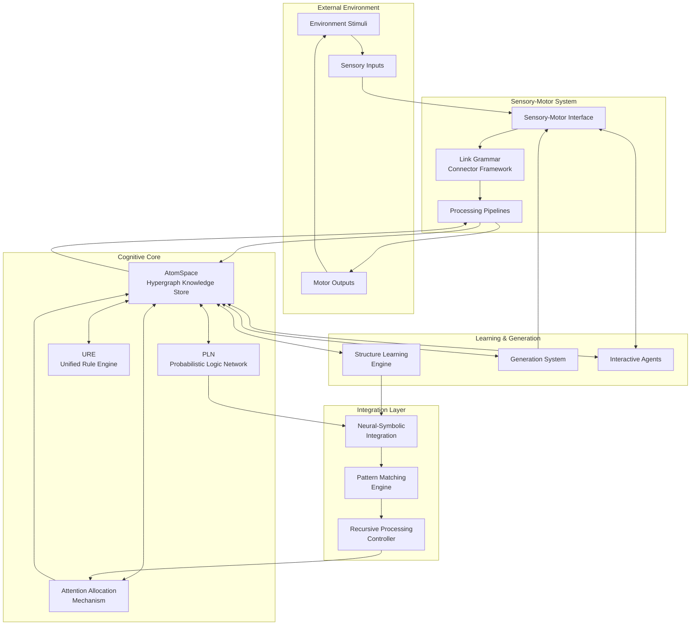
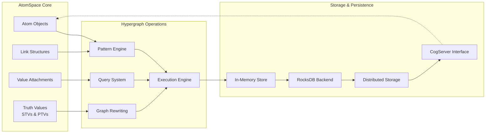
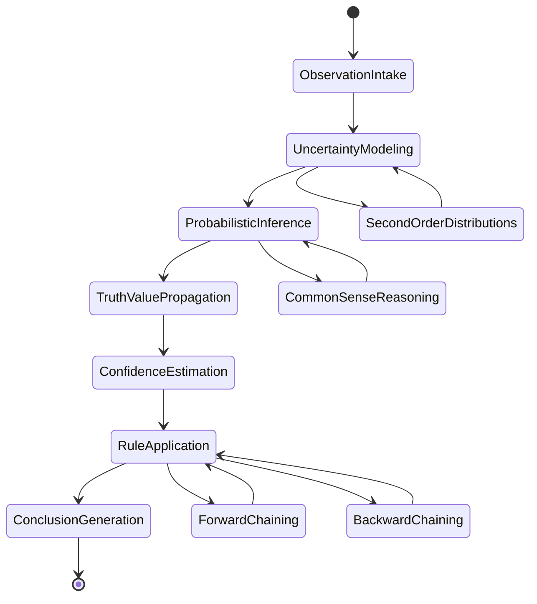
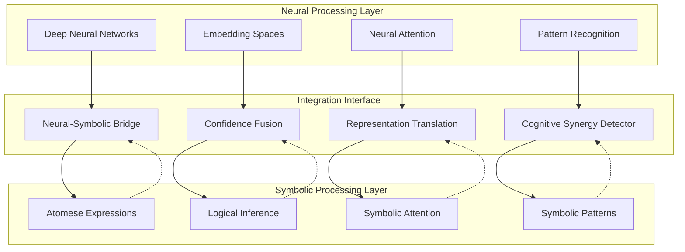
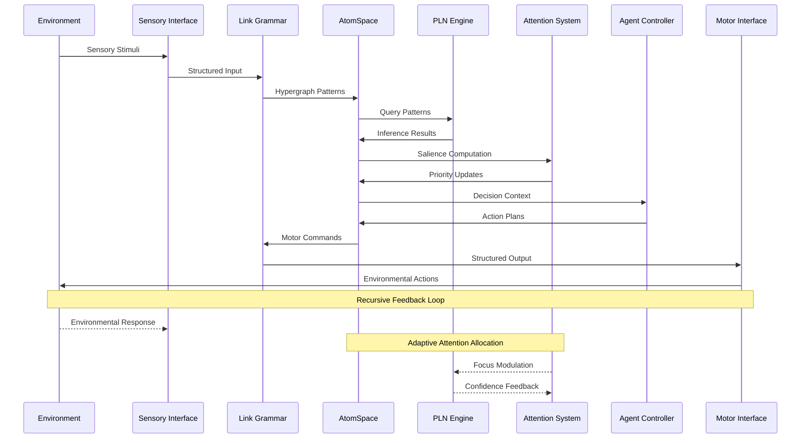
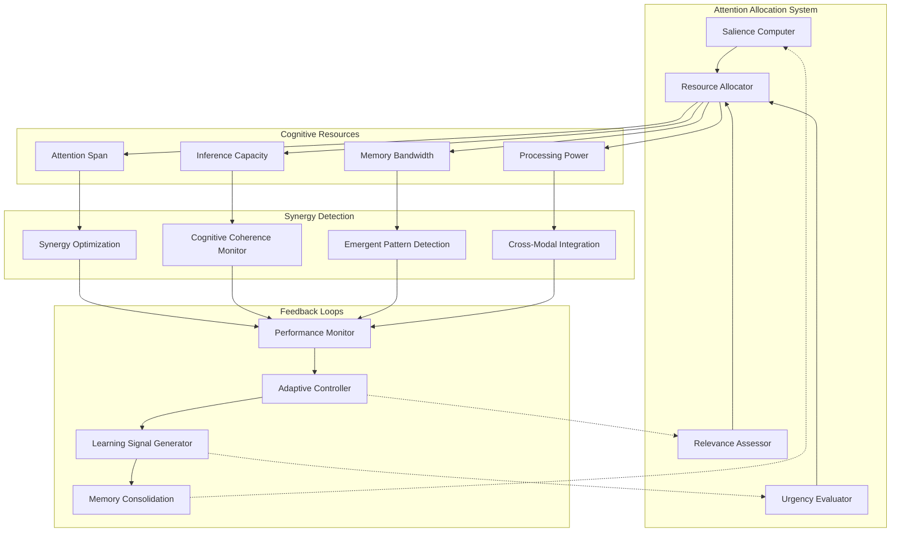
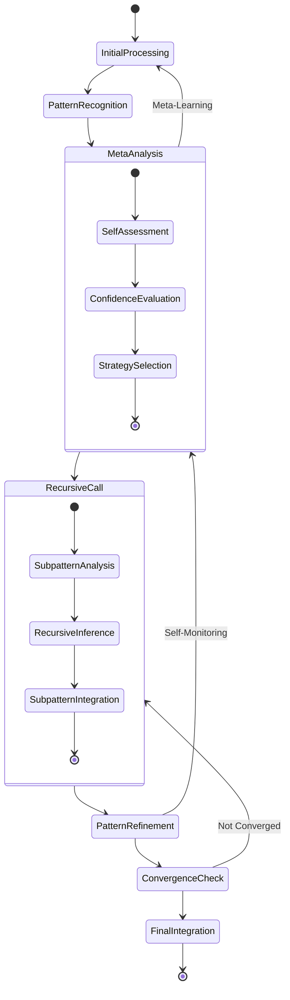
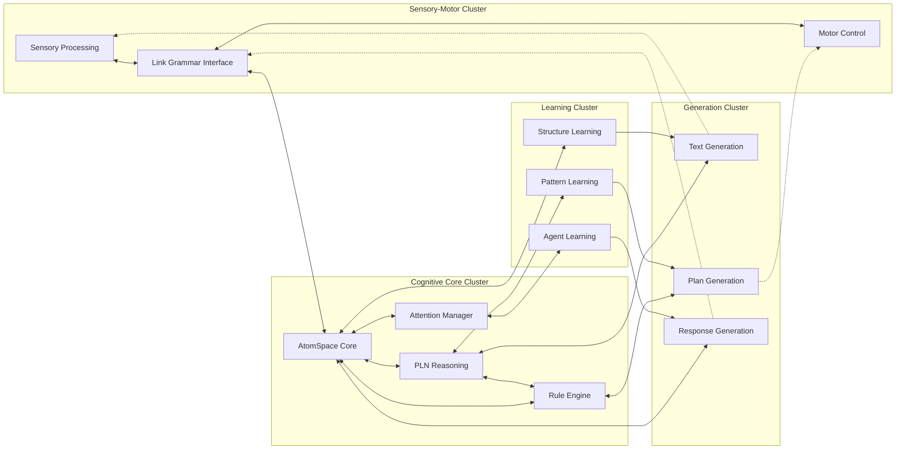
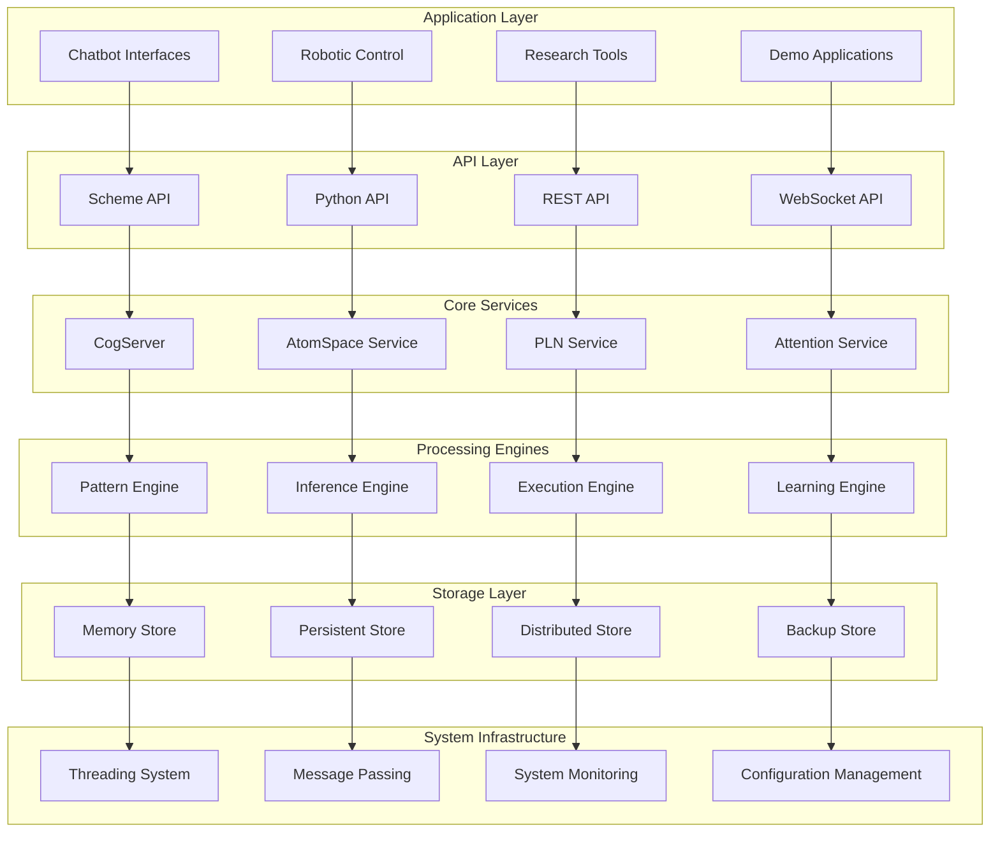

# OpenCog Central: Comprehensive Architecture Documentation

This document provides a comprehensive overview of the OpenCog Central cognitive architecture, featuring detailed Mermaid diagrams that illustrate the emergent neural-symbolic integration and hypergraph-centric processing patterns that define the MORK (Meta-Organizational Recursive Kernel) system.

## Table of Contents

1. [High-Level System Overview](#high-level-system-overview)
2. [Core Architectural Components](#core-architectural-components)
3. [Neural-Symbolic Integration Points](#neural-symbolic-integration-points)
4. [Data Flow and Signal Propagation](#data-flow-and-signal-propagation)
5. [Cognitive Synergy and Attention Allocation](#cognitive-synergy-and-attention-allocation)
6. [Recursive Processing Patterns](#recursive-processing-patterns)
7. [Module Interaction Mappings](#module-interaction-mappings)
8. [Implementation Architecture](#implementation-architecture)

---

## High-Level System Overview

The OpenCog Central architecture implements a distributed cognitive processing system with emergent neural-symbolic integration. The system is built around hypergraph pattern encoding that enables recursive system mapping and adaptive attention allocation.

### Architecture Principles

The system implements several key cognitive principles:

- **Hypergraph Pattern Encoding**: All knowledge is represented as patterns in a hypergraph structure within the AtomSpace
- **Emergent Cognitive Synergy**: Cross-modal integration emerges from the interaction of specialized subsystems
- **Adaptive Attention Allocation**: Dynamic resource allocation based on salience and goal-directed processing
- **Neural-Symbolic Integration**: Seamless combination of statistical learning and symbolic reasoning
- **Recursive System Mapping**: Self-referential processing that enables meta-cognitive capabilities

---

## Core Architectural Components

### AtomSpace: The Central Hypergraph Knowledge Representation

The AtomSpace serves as the central knowledge representation system, implementing a generalized hypergraph (metagraph) database that provides the foundation for all cognitive processing.

**Key Features:**
- **Metagraph Representation**: More flexible than traditional graph databases, supporting arbitrary arity relationships
- **Pattern Matching**: Advanced pattern engine with variable binding and conditional execution
- **Truth Value Propagation**: Probabilistic and fuzzy truth values with confidence intervals
- **Distributed Architecture**: Network-transparent storage and computation

### Probabilistic Logic Network (PLN)

PLN provides the probabilistic reasoning foundation, handling uncertainty through second-order probability distributions.

---

## Neural-Symbolic Integration Points

The architecture achieves emergent cognitive synergy through carefully designed integration points where neural processing meets symbolic reasoning.

### Integration Mechanisms

**Confidence Fusion**: Combines neural network confidence scores with symbolic truth values through weighted integration:
- Neural confidence scores → Probabilistic truth values
- Symbolic inference strength → Neural attention weights
- Cross-modal validation through bidirectional feedback

**Representation Translation**: Bi-directional mapping between vector embeddings and symbolic expressions:
- Vector → Symbol: Pattern matching in embedding space
- Symbol → Vector: Compositional embedding generation
- Attention synchronization between modalities

---

## Data Flow and Signal Propagation

The system implements sophisticated data flow patterns that enable both feedforward processing and recursive feedback loops.

### Signal Processing Pathways

**Forward Propagation Path**:
1. Environmental stimuli → Sensory processing
2. Link Grammar parsing → AtomSpace integration
3. PLN inference → Decision generation
4. Motor command synthesis → Environmental action

**Recursive Feedback Path**:
1. Environmental response → Prediction error computation
2. Attention reallocation → Priority updates
3. Pattern refinement → Knowledge base updates
4. Action adaptation → Improved motor commands

---

## Cognitive Synergy and Attention Allocation

The attention allocation mechanism implements dynamic resource management based on salience computation and goal-directed processing.

### Adaptive Attention Mechanisms

**Salience Computation**: Dynamic weighting based on:
- Novelty detection (information-theoretic surprise)
- Goal relevance (utility function optimization)
- Temporal urgency (deadline-driven priorities)
- Cross-modal consistency (coherence rewards)

**Resource Allocation Strategy**:
- Processing power: Allocated based on problem complexity
- Memory bandwidth: Prioritized for high-salience patterns
- Inference capacity: Distributed across active reasoning chains
- Attention span: Dynamically adjusted for sustained focus

---

## Recursive Processing Patterns

The architecture implements recursive processing through self-referential pattern matching and meta-cognitive monitoring.

### Recursive Implementation Pathways

**Pattern Hierarchy Processing**:
1. **Base Level**: Direct pattern matching on sensory input
2. **Meta Level**: Pattern matching on pattern matching processes
3. **Meta-Meta Level**: Monitoring and optimization of meta-processes
4. **Recursive Termination**: Convergence detection and integration

**Self-Referential Mechanisms**:
- **Code-Data Equivalence**: Atomese programs stored as AtomSpace data
- **Self-Modification**: Programs that modify their own processing patterns
- **Meta-Cognitive Monitoring**: Attention allocation for self-assessment
- **Emergent Complexity**: Higher-order patterns emerging from recursive interactions

---

## Module Interaction Mappings

The following diagram illustrates the bidirectional interaction patterns between major architectural modules.

### Inter-Module Communication Protocols

**Message Passing Architecture**:
- **AtomSpace Queries**: Pattern-based message routing
- **Value Streaming**: Continuous data flow between modules
- **Event Broadcasting**: Asynchronous notification system
- **Synchronization Points**: Coordinated processing stages

**Data Format Standards**:
- **Atomese Expressions**: Universal representation format
- **Truth Value Propagation**: Uncertainty information transfer
- **Connector Protocols**: Link Grammar interface specifications
- **Temporal Coordination**: Time-stamped processing sequences

---

## Implementation Architecture

The implementation follows a modular design that supports distributed processing and incremental development.

### Deployment Architecture

**Containerized Services**:
- Each major component runs in dedicated containers
- Docker-compose orchestration for development
- Kubernetes deployment for production scaling
- Service mesh for inter-component communication

**Scalability Patterns**:
- **Horizontal Scaling**: AtomSpace clustering across nodes
- **Vertical Scaling**: CPU/memory allocation per service
- **Load Balancing**: Request distribution across instances
- **Fault Tolerance**: Automatic failover and recovery

---

## Conclusion

The OpenCog Central architecture represents a sophisticated implementation of cognitive computing principles, integrating neural and symbolic processing through hypergraph-based knowledge representation. The recursive processing patterns and adaptive attention allocation mechanisms enable emergent cognitive behaviors that transcend the capabilities of individual components.

The modular design ensures extensibility while maintaining cognitive coherence, providing a robust foundation for artificial general intelligence research and applications. The comprehensive Mermaid documentation facilitates understanding and contribution from distributed development teams, supporting the collaborative evolution of this advanced cognitive architecture.

### Future Directions

- **Enhanced Neural Integration**: Deeper fusion of neural and symbolic processing
- **Distributed Cognition**: Multi-agent cognitive coordination
- **Quantum Integration**: Quantum-classical hybrid processing
- **Biological Modeling**: Brain-inspired architectural refinements

---

*This documentation is maintained as a living document, evolving with the architecture itself to ensure accuracy and completeness of the cognitive pattern descriptions.*