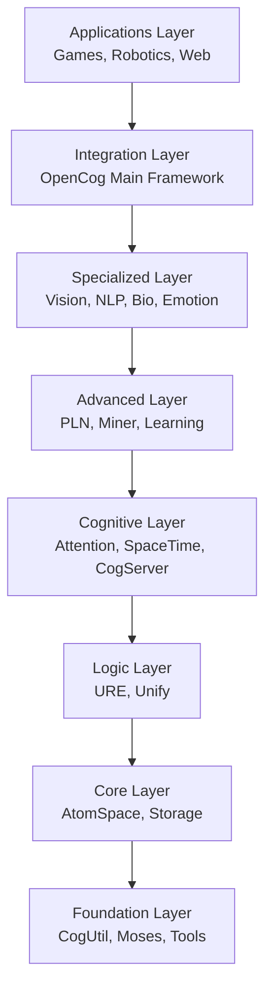
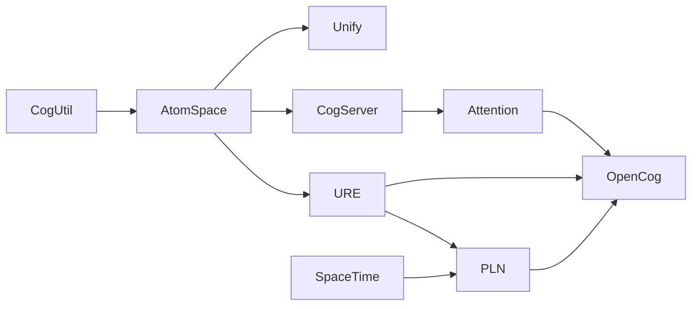

# OpenCog Central - Comprehensive Component Documentation

[](https://circleci.com/gh/opencog/opencog-central)
[](https://github.com/opencog/opencog-central)
[](LICENSE)

**The complete OpenCog ecosystem orchestration and documentation hub**

This repository consolidates **92 OpenCog components** across 13 functional categories,
providing unified build systems, dependency management, and comprehensive documentation
for the entire OpenCog artificial general intelligence (AGI) ecosystem.

## 🌟 Overview

OpenCog Central represents the most comprehensive collection of AGI components,
spanning from foundational utilities to advanced cognitive architectures.
Our systematic organization enables researchers, developers, and AGI enthusiasts
to efficiently navigate, build, and deploy complex cognitive systems.

### 📊 Repository Statistics

- **92 Components** across 13 functional categories
- **42 CMake Projects** with build automation
- **79 Documented Components** with comprehensive README files
- **Multi-language Support**: C++, Python, Rust, JavaScript, and more

### 🗂️ Functional Categories

- 🧠 **AI & Learning**: Core machine learning and reasoning algorithms (7 components)
- 📁 **AtomSpace**: Knowledge representation and storage systems (14 components)
- 🧬 **Bioinformatics**: Biological data analysis and modeling (3 components)
- 🔧 **Cognitive Tools**: Attention, memory, and cognitive utilities (11 components)
- ⚙️ **Development**: Build tools, utilities, and development aids (11 components)
- ❤️ **Emotion AI**: Emotional modeling and response systems (3 components)
- 🎮 **Games**: Gaming platforms and virtual environments (3 components)
- 🏗️ **Infrastructure**: Docker, deployment, and operational tools (6 components)
- 🗣️ **Natural Language**: Language processing and understanding systems (7 components)
- 📁 **OpenCog**: Main integration framework and core systems (6 components)
- 🤖 **Robotics**: Robotic integration and sensory processing (12 components)
- 🖥️ **Servers & Agents**: Distributed systems and agent frameworks (4 components)
- 🌐 **Web & APIs**: REST APIs, web interfaces, and client libraries (5 components)


## 🚀 Quick Start

### Prerequisites

```bash
# Ubuntu/Debian
sudo apt update && sudo apt install -y \
    build-essential cmake git \
    libboost-all-dev \
    python3-dev python3-pip \
    guile-3.0-dev

# Install Python requirements
pip3 install -r requirements.txt
```

### Build Everything

```bash
# Clone the repository
git clone https://github.com/opencog/opencog-central.git
cd opencog-central

# Quick build (foundation → core → integration)
./build-all.sh

# Or build specific categories
cd orc-as && mkdir build && cd build
cmake .. && make -j$(nproc) && sudo make install
```

### Docker Deployment

```bash
# Pre-built environment with all dependencies
docker-compose up -d

# Or build custom image
docker build -t opencog-central .
docker run -it opencog-central
```

## 📚 Component Index

This section provides a complete index of all components with their primary functions.
Click on any component name to access its detailed documentation.

### orc-ai (AI)

- **[asmoses](#asmoses)**: MOSES -- Meta-Optimizing Semantic Evolutionary Search
- **[destin](#destin)**: DeSTIN
- **[learn](#learn)**: Extracting Meaning
- **[miner](#miner)**: opencog | singnet
- **[moses](#moses)**: MOSES -- Meta-Optimizing Semantic Evolutionary Search
- **[pln](#pln)**: opencog | singnet
- **[ure](#ure)**: opencog | singnet

### orc-as (AS)

- **[atomspace](#atomspace)**: OpenCog AtomSpace
- **[atomspace-agents](#atomspaceagents)**: Obsolete
- **[atomspace-bridge](#atomspacebridge)**: AtomSpace-SQL DB Bridge
- **[atomspace-cog](#atomspacecog)**: AtomSpace CogStorage Client
- **[atomspace-dht](#atomspacedht)**: [OpenDHT](https://github.com/savoirfairelinux/opendht/wiki)
- **[atomspace-explorer](#atomspaceexplorer)**: The AtomSpace Explorer is a visualization tool for
- **[atomspace-ipfs](#atomspaceipfs)**: [IPFS](https://ipfs.io/) driver backend to the
- **[atomspace-js](#atomspacejs)**: There is nothing here, except for this README file.
- **[atomspace-metta](#atomspacemetta)**: MeTTa on the AtomSpace
- **[atomspace-restful](#atomspacerestful)**: AtomSpace RESTful Web API
- **[atomspace-rocks](#atomspacerocks)**: AtomSpace RocksDB Backend
- **[atomspace-rpc](#atomspacerpc)**: This project uses [grpc](https://grpc.io) for executing pattern matching searches on a remote [AtomS...
- **[atomspace-typescript](#atomspacetypescript)**: Contains the code for a local AtomSpace browser react-app
- **[atomspace-websockets](#atomspacewebsockets)**: The code here is now obsolete. It has been replaced by "native" support

### orc-bi (BI)

- **[agi-bio](#agibio)**: AGI-Bio
- **[cheminformatics](#cheminformatics)**: Cheminformatics
- **[pln-brca-xp](#plnbrcaxp)**: This repo contains the code for inference experiments using Probabilistic Logic Networks, PLN, on br...

### orc-ct (CT)

- **[attention](#attention)**: Attention Allocation
- **[dimensional-embedding](#dimensionalembedding)**: = Dimensional Embedding
- **[distributional-value](#distributionalvalue)**: 
- **[generate](#generate)**: 
- **[kokkos_integrations](#kokkosintegrations)**: 
- **[pattern-index](#patternindex)**: This module provides two interfaces (C++ and Guile) for a data abstraction that
- **[profile](#profile)**: [OpenCog aims to create AGI](https://wiki.opencog.org/w/The_Open_Cognition_Project)
- **[spacetime](#spacetime)**: SpaceTime Server
- **[tv-toolbox](#tvtoolbox)**: Tool box for experimenting with TV types.
- **[unify](#unify)**: opencog | singnet
- **[visualization](#visualization)**: Graphics and Visualization Tools

### orc-dv (DV)

- **[benchmark](#benchmark)**: Collection of tools and data to benchmark the AtomSpace, the pattern
- **[cogprotolab](#cogprotolab)**: See [vis-word-pairs/README](vis-word-pairs/README.md).
- **[cogutil](#cogutil)**: OpenCog Utilities
- **[external-tools](#externaltools)**: External Tools
- **[guile-dbi](#guiledbi)**: Guile DBI
- **[integrated_output](#integratedoutput)**: 
- **[node_modules](#nodemodules)**: 
- **[ocpkg](#ocpkg)**: * This script installs an OpenCog development environment on a fresh
- **[rust_crates](#rustcrates)**: 
- **[src](#src)**: 
- **[test-datasets](#testdatasets)**: test-datasets

### orc-em (EM)

- **[ghost_bridge](#ghostbridge)**: ghost_bridge
- **[loving-ai](#lovingai)**: ChatScript dialogue for the [Loving Artificial Intelligence](http://noetic.org/blog/communications-t...
- **[loving-ai-ghost](#lovingaighost)**: A port of [OpenCog's loving-ai ChatScripts](https://github.com/opencog/loving-ai) to Ghost.  Builds ...

### orc-gm (GM)

- **[TinyCog](#tinycog)**: A collection of speech, vision, and movement functionalities
- **[opencog-to-minecraft](#opencogtominecraft)**: A ROS-based module linking OpenCog and the Minecraft world. This code serves as
- **[unity3d-opencog-game](#unity3dopencoggame)**: OpenCog-Unity3D-Game

### orc-in (IN)

- **[copied-cmake](#copiedcmake)**: 
- **[copied-scm](#copiedscm)**: 
- **[copied-yml](#copiedyml)**: 
- **[docker](#docker)**: [](https...
- **[docs](#docs)**: 
- **[scripts](#scripts)**: 

### orc-nl (NL)

- **[language-learning](#languagelearning)**: 
- **[lg-atomese](#lgatomese)**: Atomese API for Link Grammar
- **[link-grammar](#linkgrammar)**: Link Grammar Parser
- **[link-grammar-website](#linkgrammarwebsite)**: The Link Grammar Website
- **[linkgrammar-relex-web](#linkgrammarrelexweb)**: Link Grammar and RelEx web demo
- **[relex](#relex)**: Stanford Parser Compatibility Mode
- **[stochastic-language-generation](#stochasticlanguagegeneration)**: Stochastic Language Generation

### orc-oc (OC)

- **[opencog](#opencog)**: OpenCog
- **[opencog-cycl](#opencogcycl)**: Opencog-Cycl
- **[opencog-debian](#opencogdebian)**: This repository contains files for packaging the [OpenCog](https://github.com/opencog) AI/AGI testbe...
- **[opencog-neo4j](#opencogneo4j)**: Google Summer of Code 2015 Proposal to implement Neo4j Graph Backing Store as described in http://wi...
- **[opencog-nix](#opencognix)**: A collection of WIP [Nix Package Manager](https://nixos.org/nix/) build expressions for opencog pack...
- **[opencog.org](#opencog.org)**: * docs: contains landing page for docs.opencog.org. Initial Theme from

### orc-ro (RO)

- **[blender_api](#blenderapi)**: I was interested in reviving the Eva portion of the opencog/docker repo, and to that end I created t...
- **[blender_api_msgs](#blenderapimsgs)**: blender_api_msgs
- **[opencog_rpi](#opencogrpi)**: Opencog Cross Compile Toolchain for Raspberry Pi3
- **[pau2motors](#pau2motors)**: pau2motors
- **[perception](#perception)**: Perception Synthesizer
- **[pi_vision](#pivision)**: pi_vision
- **[robots_config](#robotsconfig)**: Robots configuration package.
- **[ros-behavior-scripting](#rosbehaviorscripting)**: Eva Robot ROS Sensory+Motor API
- **[ros_opencog_robot_embodiment](#rosopencogrobotembodiment)**: 
- **[semantic-vision](#semanticvision)**: This is a repository hosting public discussion, documentation and milestones of the semantic vision ...
- **[sensory](#sensory)**: Sensory Atomese
- **[vision](#vision)**: > Atomese wrappers around a subset of OpenCV

### orc-sv (SV)

- **[agents](#agents)**: Atomese Agents
- **[cogserver](#cogserver)**: OpenCog CogServer
- **[logicmoo_cogserver](#logicmoocogserver)**: LOGICMOO's AtomSpace Blackboard Server (LABS)
- **[rocca](#rocca)**: <p align="left">

### orc-wb (WB)

- **[python-attic](#pythonattic)**: Old OpenCog Python Code
- **[python-client](#pythonclient)**: OpenCog Python Client
- **[python-destin](#pythondestin)**: PythonDeSTIN is a repo for the development of Python DeSTIN (PyDeSTIN).
- **[python_packages](#pythonpackages)**: 
- **[rest-api-documentation](#restapidocumentation)**: rest-api-documentation

## 🏗️ Architectural Layers

OpenCog Central is organized in architectural layers with clear dependency relationships:



### Specialized Layer

Domain-specific modules (vision, NLP, robotics, bioinformatics)

**Components (21):**
- `cheminformatics` (orc-bi)
- `semantic-vision` (orc-ro)
- `pi_vision` (orc-ro)
- `vision` (orc-ro)
- `sensory` (orc-ro)
- `visualization` (orc-ct)
- `agi-bio` (orc-bi)
- `pau2motors` (orc-ro)
- `perception` (orc-ro)
- `ros-behavior-scripting` (orc-ro)
- `robots_config` (orc-ro)
- `loving-ai-ghost` (orc-em)
- `loving-ai` (orc-em)
- `ghost_bridge` (orc-em)
- `relex` (orc-nl)
- `linkgrammar-relex-web` (orc-nl)
- `stochastic-language-generation` (orc-nl)
- `link-grammar` (orc-nl)
- `lg-atomese` (orc-nl)
- `link-grammar-website` (orc-nl)
- `TinyCog` (orc-gm)

### Advanced Layer

Advanced reasoning systems, pattern mining, and probabilistic logic

**Components (5):**
- `pln-brca-xp` (orc-bi)
- `benchmark` (orc-dv)
- `miner` (orc-ai)
- `pln` (orc-ai)
- `destin` (orc-ai)

### Foundation Layer

Basic utilities, data structures, and foundational algorithms

**Components (14):**
- `cogutil` (orc-dv)
- `blender_api_msgs` (orc-ro)
- `blender_api` (orc-ro)
- `asmoses` (orc-ai)
- `moses` (orc-ai)
- `ocpkg` (orc-dv)
- `rust_crates` (orc-dv)
- `external-tools` (orc-dv)
- `cogprotolab` (orc-dv)
- `src` (orc-dv)
- `integrated_output` (orc-dv)
- `guile-dbi` (orc-dv)
- `test-datasets` (orc-dv)
- `node_modules` (orc-dv)

### Integration Layer

Main integration frameworks and orchestration systems

**Components (14):**
- `opencog_rpi` (orc-ro)
- `ros_opencog_robot_embodiment` (orc-ro)
- `unity3d-opencog-game` (orc-gm)
- `opencog-to-minecraft` (orc-gm)
- `opencog-nix` (orc-oc)
- `opencog` (orc-oc)
- `opencog-cycl` (orc-oc)
- `opencog-neo4j` (orc-oc)
- `opencog-debian` (orc-oc)
- `opencog.org` (orc-oc)
- `rest-api-documentation` (orc-wb)
- `python-client` (orc-wb)
- `python-destin` (orc-wb)
- `python-attic` (orc-wb)

### Packaging Layer

Distribution, packaging, and deployment systems

**Components (7):**
- `python_packages` (orc-wb)
- `docs` (orc-in)
- `docker` (orc-in)
- `copied-yml` (orc-in)
- `copied-scm` (orc-in)
- `scripts` (orc-in)
- `copied-cmake` (orc-in)

### Learning Layer

Machine learning algorithms and adaptive systems

**Components (3):**
- `language-learning` (orc-nl)
- `generate` (orc-ct)
- `learn` (orc-ai)

### Core Layer

Knowledge representation, storage systems, and core data management

**Components (15):**
- `atomspace-agents` (orc-as)
- `atomspace-dht` (orc-as)
- `atomspace` (orc-as)
- `atomspace-rocks` (orc-as)
- `atomspace-ipfs` (orc-as)
- `atomspace-websockets` (orc-as)
- `atomspace-restful` (orc-as)
- `atomspace-typescript` (orc-as)
- `atomspace-explorer` (orc-as)
- `atomspace-js` (orc-as)
- `atomspace-bridge` (orc-as)
- `atomspace-metta` (orc-as)
- `atomspace-rpc` (orc-as)
- `atomspace-cog` (orc-as)
- `agents` (orc-sv)

### Cognitive Layer

Attention mechanisms, cognitive servers, and mental processes

**Components (11):**
- `attention` (orc-ct)
- `spacetime` (orc-ct)
- `logicmoo_cogserver` (orc-sv)
- `cogserver` (orc-sv)
- `pattern-index` (orc-ct)
- `tv-toolbox` (orc-ct)
- `kokkos_integrations` (orc-ct)
- `dimensional-embedding` (orc-ct)
- `distributional-value` (orc-ct)
- `profile` (orc-ct)
- `rocca` (orc-sv)

### Logic Layer

Logical reasoning, unification, and rule-based inference

**Components (2):**
- `unify` (orc-ct)
- `ure` (orc-ai)

## 🔗 Dependency Analysis

### Critical Dependencies

Based on CMakeLists.txt analysis and README specifications:

1. **CogUtil** → Foundation for 31+ components
2. **AtomSpace** → Core knowledge representation for 29+ components
3. **URE** → Advanced reasoning requiring AtomSpace + Unify
4. **CogServer** → Distributed systems enabling Attention + Learn
5. **SpaceTime** → Temporal reasoning required by PLN

### Dependency Chains



### Build Parallelization

Components can be built in parallel within layers:

- **Layer 1**: CogUtil, Moses (parallel)
- **Layer 2**: AtomSpace + extensions (parallel after CogUtil)
- **Layer 3**: URE, Unify, CogServer (parallel after AtomSpace)
- **Layer 4**: Advanced systems (parallel after Layer 3)

## 🔧 Recommended Build Order

### Complete Build Sequence

```bash
# Phase 1: Foundation
cd orc-dv/cogutil && mkdir build && cd build && cmake .. && make -j$(nproc) && make install
cd ../../moses && mkdir build && cd build && cmake .. && make -j$(nproc) && make install

# Phase 2: Core Systems
cd ../../../orc-as/atomspace && mkdir build && cd build && cmake .. && make -j$(nproc) && make install
cd ../atomspace-rocks && mkdir build && cd build && cmake .. && make -j$(nproc) && make install
cd ../atomspace-restful && mkdir build && cd build && cmake .. && make -j$(nproc) && make install

# Phase 3: Logic & Reasoning
cd ../../../orc-ct/unify && mkdir build && cd build && cmake .. && make -j$(nproc) && make install
cd ../../orc-ai/ure && mkdir build && cd build && cmake .. && make -j$(nproc) && make install

# Phase 4: Cognitive Systems
cd ../../orc-sv/cogserver && mkdir build && cd build && cmake .. && make -j$(nproc) && make install
cd ../../orc-ct/attention && mkdir build && cd build && cmake .. && make -j$(nproc) && make install
cd ../spacetime && mkdir build && cd build && cmake .. && make -j$(nproc) && make install

# Phase 5: Advanced Systems
cd ../../orc-ai/pln && mkdir build && cd build && cmake .. && make -j$(nproc) && make install
cd ../miner && mkdir build && cd build && cmake .. && make -j$(nproc) && make install

# Phase 6: Integration
cd ../../orc-oc/opencog && mkdir build && cd build && cmake .. && make -j$(nproc) && make install
```

### CircleCI Integration

Our CircleCI configuration implements this build order with proper
dependency management and parallel execution where possible.

## 📖 Detailed Component Documentation

This section provides comprehensive documentation for each component,
extracted from individual README files and enhanced with dependency analysis.

### ORC-AI Components

#### asmoses

**Category**: orc-ai  
**Type**: rust_crate  
**Language**: rust  
**Has CMake**: ✅  
**Has README**: ✅  

**Description**: MOSES -- Meta-Optimizing Semantic Evolutionary Search

**Dependencies**:
- CogUtil
- Boost
- Boost
- Cxxtest
- AtomSpace
- MPI
- URE
- VALGRIND
- Doxygen

**Overview**:
MOSES -- Meta-Optimizing Semantic Evolutionary Search ===================================================== opencog | singnet...

**Location**: `/home/runner/work/opencog-central/opencog-central/orc-ai/asmoses`

---

#### destin

**Category**: orc-ai  
**Type**: rust_crate  
**Language**: rust  
**Has CMake**: ❌  
**Has README**: ✅  

**Description**: DeSTIN

**Overview**:
DeSTIN ============= Papers about DeSTIN...

**Location**: `/home/runner/work/opencog-central/opencog-central/orc-ai/destin`

---

#### learn

**Category**: orc-ai  
**Type**: rust_crate  
**Language**: rust  
**Has CMake**: ✅  
**Has README**: ✅  

**Description**: Extracting Meaning

**Dependencies**:
- CogUtil
- AtomSpace
- CogServer
- AtomSpaceRocks

**Overview**:
Learning ======== The "big ideas" describe how this project thinks about the world....

**Location**: `/home/runner/work/opencog-central/opencog-central/orc-ai/learn`

---

#### miner

**Category**: orc-ai  
**Type**: rust_crate  
**Language**: rust  
**Has CMake**: ✅  
**Has README**: ✅  

**Description**: opencog | singnet

**Dependencies**:
- CogUtil
- AtomSpace
- Unify
- URE
- Boost
- Boost
- Boost
- Cxxtest
- VALGRIND

**Overview**:
opencog | singnet ------- | ------- The miner (or pattern miner) is a frequent and surprise subhypergraph...

**Location**: `/home/runner/work/opencog-central/opencog-central/orc-ai/miner`

---

#### moses

**Category**: orc-ai  
**Type**: rust_crate  
**Language**: rust  
**Has CMake**: ✅  
**Has README**: ✅  

**Description**: MOSES -- Meta-Optimizing Semantic Evolutionary Search

**Dependencies**:
- CogUtil
- Boost
- Boost
- Cxxtest
- MPI
- VALGRIND
- Doxygen

**Overview**:
MOSES -- Meta-Optimizing Semantic Evolutionary Search ===================================================== MOSES is a machine-learning tool; it is an "evolutionary program...

**Location**: `/home/runner/work/opencog-central/opencog-central/orc-ai/moses`

---

#### pln

**Category**: orc-ai  
**Type**: rust_crate  
**Language**: rust  
**Has CMake**: ✅  
**Has README**: ✅  

**Description**: opencog | singnet

**Dependencies**:
- CogUtil
- AtomSpace
- SpaceTime
- Unify
- URE
- Cxxtest

**Overview**:
opencog | singnet ------- | ------- Probabilistic Logic Network, or PLN for short, is a logic invented by...

**Location**: `/home/runner/work/opencog-central/opencog-central/orc-ai/pln`

---

#### ure

**Category**: orc-ai  
**Type**: rust_crate  
**Language**: rust  
**Has CMake**: ✅  
**Has README**: ✅  

**Description**: opencog | singnet

**Dependencies**:
- CogUtil
- AtomSpace
- Unify
- Boost
- Cxxtest
- VALGRIND

**Overview**:
opencog | singnet ------- | ------- The Unified Rule Engine, URE for short, is a term rewriting engine for...

**Location**: `/home/runner/work/opencog-central/opencog-central/orc-ai/ure`

---

### ORC-AS Components

#### atomspace

**Category**: orc-as  
**Type**: rust_crate  
**Language**: rust  
**Has CMake**: ✅  
**Has README**: ✅  

**Description**: OpenCog AtomSpace

**Dependencies**:
- CogUtil
- Boost
- Cxxtest
- Folly
- OCaml
- Stack
- UnixODBC
- PGSQL
- VALGRIND
- Doxygen

**Overview**:
OpenCog AtomSpace ================= The OpenCog AtomSpace is an in-RAM knowledge representation (KR)...

**Location**: `/home/runner/work/opencog-central/opencog-central/orc-as/atomspace`

---

#### atomspace-agents

**Category**: orc-as  
**Type**: rust_crate  
**Language**: rust  
**Has CMake**: ✅  
**Has README**: ✅  

**Description**: Obsolete

**Dependencies**:
- CogUtil
- AtomSpace
- Boost
- Cxxtest
- VALGRIND
- Doxygen

**Overview**:
Obsolete -------- A version of proxy agents has been implemented, and can be found...

**Location**: `/home/runner/work/opencog-central/opencog-central/orc-as/atomspace-agents`

---

#### atomspace-bridge

**Category**: orc-as  
**Type**: rust_crate  
**Language**: rust  
**Has CMake**: ✅  
**Has README**: ✅  

**Description**: AtomSpace-SQL DB Bridge

**Dependencies**:
- CogUtil
- AtomSpace
- PGSQL
- Cxxtest
- VALGRIND
- Doxygen

**Overview**:
AtomSpace-SQL DB Bridge ======================= The bridge connects pre-existing SQL DB's to the AtomSpace, so that...

**Location**: `/home/runner/work/opencog-central/opencog-central/orc-as/atomspace-bridge`

---

#### atomspace-cog

**Category**: orc-as  
**Type**: rust_crate  
**Language**: rust  
**Has CMake**: ✅  
**Has README**: ✅  

**Description**: AtomSpace CogStorage Client

**Dependencies**:
- CogUtil
- AtomSpace
- CogServer
- Cxxtest
- VALGRIND
- Doxygen

**Overview**:
AtomSpace CogStorage Client =========================== <!--...

**Location**: `/home/runner/work/opencog-central/opencog-central/orc-as/atomspace-cog`

---

#### atomspace-dht

**Category**: orc-as  
**Type**: rust_crate  
**Language**: rust  
**Has CMake**: ✅  
**Has README**: ✅  

**Description**: [OpenDHT](https://github.com/savoirfairelinux/opendht/wiki)

**Dependencies**:
- CogUtil
- AtomSpace
- Cxxtest
- Doxygen

**Overview**:
[OpenDHT](https://github.com/savoirfairelinux/opendht/wiki) backend driver to the [AtomSpace](https://github.com/opencog/atomspace) (hyper-)graph database....

**Location**: `/home/runner/work/opencog-central/opencog-central/orc-as/atomspace-dht`

---

#### atomspace-explorer

**Category**: orc-as  
**Type**: npm_package  
**Language**: javascript  
**Has CMake**: ❌  
**Has README**: ✅  

**Description**: The AtomSpace Explorer is a visualization tool for

**Overview**:
The AtomSpace Explorer is a visualization tool for [Atoms](https://wiki.opencog.org/w/Atom) in the [AtomSpace](https://github.com/opencog/atomspace)....

**Location**: `/home/runner/work/opencog-central/opencog-central/orc-as/atomspace-explorer`

---

#### atomspace-ipfs

**Category**: orc-as  
**Type**: rust_crate  
**Language**: rust  
**Has CMake**: ✅  
**Has README**: ✅  

**Description**: [IPFS](https://ipfs.io/) driver backend to the

**Dependencies**:
- CogUtil
- AtomSpace
- Cxxtest
- Doxygen

**Overview**:
[IPFS](https://ipfs.io/) driver backend to the [AtomSpace](https://github.com/opencog/atomspace) (hyper-)graph database. The code here is a backend driver to the AtomSpace graph database,...

**Location**: `/home/runner/work/opencog-central/opencog-central/orc-as/atomspace-ipfs`

---

#### atomspace-js

**Category**: orc-as  
**Type**: rust_crate  
**Language**: rust  
**Has CMake**: ❌  
**Has README**: ✅  

**Description**: There is nothing here, except for this README file.

**Overview**:
There is nothing here, except for this README file. JavaScript bindings to the AtomSpace Version 0.0.0 - there is nothing here yet....

**Location**: `/home/runner/work/opencog-central/opencog-central/orc-as/atomspace-js`

---

#### atomspace-metta

**Category**: orc-as  
**Type**: rust_crate  
**Language**: rust  
**Has CMake**: ✅  
**Has README**: ✅  

**Description**: MeTTa on the AtomSpace

**Dependencies**:
- CogUtil
- AtomSpace
- Cxxtest
- Doxygen

**Overview**:
MeTTa on the AtomSpace ====================== The MeTTa concept can be implemented on top of the AtomSpace. This repo...

**Location**: `/home/runner/work/opencog-central/opencog-central/orc-as/atomspace-metta`

---

#### atomspace-restful

**Category**: orc-as  
**Type**: rust_crate  
**Language**: rust  
**Has CMake**: ✅  
**Has README**: ✅  

**Description**: AtomSpace RESTful Web API

**Dependencies**:
- Boost
- CogUtil
- AtomSpace
- CogServer
- Cxxtest
- PkgConfig
- TBB
- ZMQ
- AttentionBank
- Doxygen
- jsoncpp

**Overview**:
AtomSpace RESTful Web API ========================= Attention! This code is obsolete!...

**Location**: `/home/runner/work/opencog-central/opencog-central/orc-as/atomspace-restful`

---

#### atomspace-rocks

**Category**: orc-as  
**Type**: rust_crate  
**Language**: rust  
**Has CMake**: ✅  
**Has README**: ✅  

**Description**: AtomSpace RocksDB Backend

**Dependencies**:
- CogUtil
- AtomSpace
- RocksDB
- Cxxtest
- VALGRIND
- Doxygen

**Overview**:
AtomSpace RocksDB Backend ========================= Save and restore AtomSpace contents to a RocksDB database. The RocksDB...

**Location**: `/home/runner/work/opencog-central/opencog-central/orc-as/atomspace-rocks`

---

#### atomspace-rpc

**Category**: orc-as  
**Type**: rust_crate  
**Language**: rust  
**Has CMake**: ✅  
**Has README**: ✅  

**Description**: This project uses [grpc](https://grpc.io) for executing pattern matching searches on a remote [AtomSpace](https://github.com/opencog).

**Dependencies**:
- Boost
- CogUtil
- AtomSpace
- Cxxtest

**Overview**:
This project uses [grpc](https://grpc.io) for executing pattern matching searches on a remote [AtomSpace](https://github.com/opencog). It also allows users to create multiple atomspaces and access the...

**Location**: `/home/runner/work/opencog-central/opencog-central/orc-as/atomspace-rpc`

---

#### atomspace-typescript

**Category**: orc-as  
**Type**: npm_package  
**Language**: javascript  
**Has CMake**: ❌  
**Has README**: ✅  

**Description**: Contains the code for a local AtomSpace browser react-app

**Overview**:
This project offers two components: * A way to interact with an OpenCog [AtomSpace](https://github.com/opencog/atomspace)...

**Location**: `/home/runner/work/opencog-central/opencog-central/orc-as/atomspace-typescript`

---

#### atomspace-websockets

**Category**: orc-as  
**Type**: rust_crate  
**Language**: rust  
**Has CMake**: ✅  
**Has README**: ✅  

**Description**: The code here is now obsolete. It has been replaced by "native" support

**Dependencies**:
- Boost
- CogUtil
- AtomSpace
- Cxxtest

**Overview**:
The code here is now obsolete. It has been replaced by "native" support in the [CogServer](https://github.com/opencog/cogserver/). A JSON+websoockets interface is provided on port 18080. See the webso...

**Location**: `/home/runner/work/opencog-central/opencog-central/orc-as/atomspace-websockets`

---

### ORC-BI Components

#### agi-bio

**Category**: orc-bi  
**Type**: rust_crate  
**Language**: rust  
**Has CMake**: ✅  
**Has README**: ✅  

**Description**: AGI-Bio

**Dependencies**:
- CogUtil
- AtomSpace

**Overview**:
AGI-Bio ======= Genomic and proteomic research using the OpenCog toolset....

**Location**: `/home/runner/work/opencog-central/opencog-central/orc-bi/agi-bio`

---

#### cheminformatics

**Category**: orc-bi  
**Type**: rust_crate  
**Language**: rust  
**Has CMake**: ✅  
**Has README**: ✅  

**Description**: Cheminformatics

**Dependencies**:
- CogUtil
- AtomSpace

**Overview**:
Cheminformatics =============== This is an early attempt to use OpenCog for cheminformatics....

**Location**: `/home/runner/work/opencog-central/opencog-central/orc-bi/cheminformatics`

---

#### pln-brca-xp

**Category**: orc-bi  
**Type**: rust_crate  
**Language**: rust  
**Has CMake**: ❌  
**Has README**: ✅  

**Description**: This repo contains the code for inference experiments using Probabilistic Logic Networks, PLN, on breast cancer dataset. It is based on the work in [singnet/cancer](https://github.com/singnet/cancer)

**Overview**:
This repo contains the code for inference experiments using Probabilistic Logic Networks, PLN, on breast cancer dataset. It is based on the work in [singnet/cancer](https://github.com/singnet/cancer) ...

**Location**: `/home/runner/work/opencog-central/opencog-central/orc-bi/pln-brca-xp`

---

### ORC-CT Components

#### attention

**Category**: orc-ct  
**Type**: rust_crate  
**Language**: rust  
**Has CMake**: ✅  
**Has README**: ✅  

**Description**: Attention Allocation

**Dependencies**:
- CogUtil
- AtomSpace
- CogServer
- Boost
- Boost
- Cxxtest
- VALGRIND
- Doxygen

**Overview**:
Attention Allocation ===================== opencog | singnet...

**Location**: `/home/runner/work/opencog-central/opencog-central/orc-ct/attention`

---

#### dimensional-embedding

**Category**: orc-ct  
**Type**: rust_crate  
**Language**: rust  
**Has CMake**: ✅  
**Has README**: ✅  

**Description**: = Dimensional Embedding

**Dependencies**:
- CogUtil
- AtomSpace
- Boost
- Cxxtest
- Doxygen

**Overview**:
= Dimensional Embedding This implements a method of dimensional embedding of the atomspace using the Harel-Koren algorithm as described on...

**Location**: `/home/runner/work/opencog-central/opencog-central/orc-ct/dimensional-embedding`

---

#### distributional-value

**Category**: orc-ct  
**Type**: rust_crate  
**Language**: rust  
**Has CMake**: ❌  
**Has README**: ❌  

**Location**: `/home/runner/work/opencog-central/opencog-central/orc-ct/distributional-value`

---

#### generate

**Category**: orc-ct  
**Type**: rust_crate  
**Language**: rust  
**Has CMake**: ✅  
**Has README**: ✅  

**Description**: 

**Dependencies**:
- CogUtil
- AtomSpace
- Cxxtest

**Overview**:
 Graphical networks are generic: natural language parse trees are graphs. So are the chains of axioms and logical deductions in a mathematical...

**Location**: `/home/runner/work/opencog-central/opencog-central/orc-ct/generate`

---

#### kokkos_integrations

**Category**: orc-ct  
**Type**: unknown  
**Language**: unknown  
**Has CMake**: ❌  
**Has README**: ❌  

**Location**: `/home/runner/work/opencog-central/opencog-central/orc-ct/kokkos_integrations`

---

#### pattern-index

**Category**: orc-ct  
**Type**: rust_crate  
**Language**: rust  
**Has CMake**: ✅  
**Has README**: ✅  

**Description**: This module provides two interfaces (C++ and Guile) for a data abstraction that

**Dependencies**:
- CogUtil
- AtomSpace
- Boost
- Cxxtest
- Doxygen

**Overview**:
This module provides two interfaces (C++ and Guile) for a data abstraction that allows the user to create indexes for subsets of Atoms from the AtomSpace and then submit queries to retrieve subgraphs ...

**Location**: `/home/runner/work/opencog-central/opencog-central/orc-ct/pattern-index`

---

#### profile

**Category**: orc-ct  
**Type**: rust_crate  
**Language**: rust  
**Has CMake**: ❌  
**Has README**: ✅  

**Description**: [OpenCog aims to create AGI](https://wiki.opencog.org/w/The_Open_Cognition_Project)

**Overview**:
[OpenCog aims to create AGI](https://wiki.opencog.org/w/The_Open_Cognition_Project) with a combination of exploration, engineering and basic science research. Side quests have included robotics system...

**Location**: `/home/runner/work/opencog-central/opencog-central/orc-ct/profile`

---

#### spacetime

**Category**: orc-ct  
**Type**: rust_crate  
**Language**: rust  
**Has CMake**: ✅  
**Has README**: ✅  

**Description**: SpaceTime Server

**Dependencies**:
- CogUtil
- AtomSpace
- Boost
- Cxxtest
- Octomap
- Doxygen

**Overview**:
SpaceTime Server ================ opencog...

**Location**: `/home/runner/work/opencog-central/opencog-central/orc-ct/spacetime`

---

#### tv-toolbox

**Category**: orc-ct  
**Type**: rust_crate  
**Language**: rust  
**Has CMake**: ❌  
**Has README**: ✅  

**Description**: Tool box for experimenting with TV types.

**Overview**:
Tool box for experimenting with TV types. It mostly contains a Haskell module TVToolBox with a collection of functions to experiment with TVs, in particular TV conversion (Simple...

**Location**: `/home/runner/work/opencog-central/opencog-central/orc-ct/tv-toolbox`

---

#### unify

**Category**: orc-ct  
**Type**: rust_crate  
**Language**: rust  
**Has CMake**: ✅  
**Has README**: ✅  

**Description**: opencog | singnet

**Dependencies**:
- CogUtil
- AtomSpace
- Boost
- Cxxtest
- VALGRIND

**Overview**:
opencog | singnet ------- | ------- Unify, the AtomSpace unifier, is an expression unifier for the AtomSpace....

**Location**: `/home/runner/work/opencog-central/opencog-central/orc-ct/unify`

---

#### visualization

**Category**: orc-ct  
**Type**: rust_crate  
**Language**: rust  
**Has CMake**: ✅  
**Has README**: ✅  

**Description**: Graphics and Visualization Tools

**Dependencies**:
- CogUtil
- AtomSpace
- Boost
- GTK3
- Doxygen

**Overview**:
Graphics and Visualization Tools -------------------------------- This repository has been archived. The three tools below have not been...

**Location**: `/home/runner/work/opencog-central/opencog-central/orc-ct/visualization`

---

### ORC-DV Components

#### benchmark

**Category**: orc-dv  
**Type**: rust_crate  
**Language**: rust  
**Has CMake**: ✅  
**Has README**: ✅  

**Description**: Collection of tools and data to benchmark the AtomSpace, the pattern

**Dependencies**:
- CogUtil
- AtomSpace
- URE
- benchmark
- Boost
- Boost

**Overview**:
Collection of tools and data to benchmark the AtomSpace, the pattern matcher and other OpenCog processes. Each distinct benchmark has it's own instructions for building and...

**Location**: `/home/runner/work/opencog-central/opencog-central/orc-dv/benchmark`

---

#### cogprotolab

**Category**: orc-dv  
**Type**: rust_crate  
**Language**: rust  
**Has CMake**: ❌  
**Has README**: ✅  

**Description**: See [vis-word-pairs/README](vis-word-pairs/README.md).

**Overview**:
See [vis-word-pairs/README](vis-word-pairs/README.md)....

**Location**: `/home/runner/work/opencog-central/opencog-central/orc-dv/cogprotolab`

---

#### cogutil

**Category**: orc-dv  
**Type**: rust_crate  
**Language**: rust  
**Has CMake**: ✅  
**Has README**: ✅  

**Description**: OpenCog Utilities

**Dependencies**:
- PThreads
- STLPort
- Boost
- Boost
- Cxxtest
- GNUBacktrace
- BFD
- Iberty
- ParallelSTL
- Doxygen

**Overview**:
OpenCog Utilities ================= The OpenCog utilities is a miscellaneous collection of C++ utilities...

**Location**: `/home/runner/work/opencog-central/opencog-central/orc-dv/cogutil`

---

#### external-tools

**Category**: orc-dv  
**Type**: rust_crate  
**Language**: rust  
**Has CMake**: ❌  
**Has README**: ✅  

**Description**: External Tools

**Overview**:
External Tools ============== This repository contains stand-alone tools that are independent of the main OpenCog source tree. Examples of the kinds of tools that might be added to this repository:...

**Location**: `/home/runner/work/opencog-central/opencog-central/orc-dv/external-tools`

---

#### guile-dbi

**Category**: orc-dv  
**Type**: rust_crate  
**Language**: rust  
**Has CMake**: ❌  
**Has README**: ✅  

**Description**: Guile DBI

**Overview**:
Guile DBI ========= **guile-dbi** provides a simple, generic, easy-to-use **guile scheme**...

**Location**: `/home/runner/work/opencog-central/opencog-central/orc-dv/guile-dbi`

---

#### integrated_output

**Category**: orc-dv  
**Type**: unknown  
**Language**: unknown  
**Has CMake**: ❌  
**Has README**: ❌  

**Location**: `/home/runner/work/opencog-central/opencog-central/orc-dv/integrated_output`

---

#### node_modules

**Category**: orc-dv  
**Type**: rust_crate  
**Language**: rust  
**Has CMake**: ❌  
**Has README**: ❌  

**Location**: `/home/runner/work/opencog-central/opencog-central/orc-dv/node_modules`

---

#### ocpkg

**Category**: orc-dv  
**Type**: rust_crate  
**Language**: rust  
**Has CMake**: ❌  
**Has README**: ✅  

**Description**: * This script installs an OpenCog development environment on a fresh

**Overview**:
* This script installs an OpenCog development environment on a fresh installation of Ubuntu >= 14.04 . It has options to selectively download, build, test, install OpenCog projects....

**Location**: `/home/runner/work/opencog-central/opencog-central/orc-dv/ocpkg`

---

#### rust_crates

**Category**: orc-dv  
**Type**: unknown  
**Language**: unknown  
**Has CMake**: ❌  
**Has README**: ❌  

**Location**: `/home/runner/work/opencog-central/opencog-central/orc-dv/rust_crates`

---

#### src

**Category**: orc-dv  
**Type**: rust_crate  
**Language**: rust  
**Has CMake**: ❌  
**Has README**: ❌  

**Location**: `/home/runner/work/opencog-central/opencog-central/orc-dv/src`

---

#### test-datasets

**Category**: orc-dv  
**Type**: rust_crate  
**Language**: rust  
**Has CMake**: ❌  
**Has README**: ✅  

**Description**: test-datasets

**Overview**:
test-datasets ============= Reference AtomSpace files for testing and development...

**Location**: `/home/runner/work/opencog-central/opencog-central/orc-dv/test-datasets`

---

### ORC-EM Components

#### ghost_bridge

**Category**: orc-em  
**Type**: python_package  
**Language**: python  
**Has CMake**: ✅  
**Has README**: ✅  

**Description**: ghost_bridge

**Dependencies**:
- catkin
- catkin
- Boost
- catkin
- catkin

**Overview**:
ghost_bridge ============ ghost_bridge is a ROS package that connects the Hanson Robotics stack and [GHOST](https://github.com/opencog/opencog/tree/master/opencog/ghost)....

**Location**: `/home/runner/work/opencog-central/opencog-central/orc-em/ghost_bridge`

---

#### loving-ai

**Category**: orc-em  
**Type**: rust_crate  
**Language**: rust  
**Has CMake**: ❌  
**Has README**: ✅  

**Description**: ChatScript dialogue for the [Loving Artificial Intelligence](http://noetic.org/blog/communications-team/loving-artificial) project. This is a work in progress.

**Overview**:
ChatScript dialogue for the [Loving Artificial Intelligence](http://noetic.org/blog/communications-team/loving-artificial) project. This is a work in progress....

**Location**: `/home/runner/work/opencog-central/opencog-central/orc-em/loving-ai`

---

#### loving-ai-ghost

**Category**: orc-em  
**Type**: rust_crate  
**Language**: rust  
**Has CMake**: ❌  
**Has README**: ✅  

**Description**: A port of [OpenCog's loving-ai ChatScripts](https://github.com/opencog/loving-ai) to Ghost.  Builds upon the [Loving AI Project](http://lovingai.org/#about).

**Overview**:
A port of [OpenCog's loving-ai ChatScripts](https://github.com/opencog/loving-ai) to Ghost.  Builds upon the [Loving AI Project](http://lovingai.org/#about)....

**Location**: `/home/runner/work/opencog-central/opencog-central/orc-em/loving-ai-ghost`

---

### ORC-GM Components

#### TinyCog

**Category**: orc-gm  
**Type**: rust_crate  
**Language**: rust  
**Has CMake**: ✅  
**Has README**: ✅  

**Description**: A collection of speech, vision, and movement functionalities

**Dependencies**:
- OpenCV
- dlib
- Protobuf
- raspicam
- Guile
- PkgConfig
- AtomSpace
- OpenMP
- PocketSphinx
- Festival
- EST
- WiringPi
- alsa

**Overview**:
A collection of speech, vision, and movement functionalities aimed at small or toy robots on embedded systems, such as the Raspberry Pi computer. High level reasoning, language understanding,...

**Location**: `/home/runner/work/opencog-central/opencog-central/orc-gm/TinyCog`

---

#### opencog-to-minecraft

**Category**: orc-gm  
**Type**: rust_crate  
**Language**: rust  
**Has CMake**: ❌  
**Has README**: ✅  

**Description**: A ROS-based module linking OpenCog and the Minecraft world. This code serves as

**Overview**:
A ROS-based module linking OpenCog and the Minecraft world. This code serves as a starting point for integrating the two environments. The code is in a 'heavy experimentation' phase, and will therefor...

**Location**: `/home/runner/work/opencog-central/opencog-central/orc-gm/opencog-to-minecraft`

---

#### unity3d-opencog-game

**Category**: orc-gm  
**Type**: rust_crate  
**Language**: rust  
**Has CMake**: ❌  
**Has README**: ✅  

**Description**: OpenCog-Unity3D-Game

**Overview**:
OpenCog-Unity3D-Game ==================== Description...

**Location**: `/home/runner/work/opencog-central/opencog-central/orc-gm/unity3d-opencog-game`

---

### ORC-IN Components

#### copied-cmake

**Category**: orc-in  
**Type**: cmake_project  
**Language**: unknown  
**Has CMake**: ✅  
**Has README**: ❌  

**Location**: `/home/runner/work/opencog-central/opencog-central/orc-in/copied-cmake`

---

#### copied-scm

**Category**: orc-in  
**Type**: unknown  
**Language**: unknown  
**Has CMake**: ❌  
**Has README**: ❌  

**Location**: `/home/runner/work/opencog-central/opencog-central/orc-in/copied-scm`

---

#### copied-yml

**Category**: orc-in  
**Type**: unknown  
**Language**: unknown  
**Has CMake**: ❌  
**Has README**: ❌  

**Location**: `/home/runner/work/opencog-central/opencog-central/orc-in/copied-yml`

---

#### docker

**Category**: orc-in  
**Type**: rust_crate  
**Language**: rust  
**Has CMake**: ❌  
**Has README**: ✅  

**Description**: [](https://github.com/opencog/docker/actions)

**Overview**:
This repository contains various docker images for demoing and using various parts of the OpenCog project. Using the docker images here is the easiest way to get interesting parts of OpenCog running....

**Location**: `/home/runner/work/opencog-central/opencog-central/orc-in/docker`

---

#### docs

**Category**: orc-in  
**Type**: unknown  
**Language**: unknown  
**Has CMake**: ❌  
**Has README**: ❌  

**Location**: `/home/runner/work/opencog-central/opencog-central/orc-in/docs`

---

#### scripts

**Category**: orc-in  
**Type**: unknown  
**Language**: unknown  
**Has CMake**: ❌  
**Has README**: ❌  

**Location**: `/home/runner/work/opencog-central/opencog-central/orc-in/scripts`

---

### ORC-NL Components

#### language-learning

**Category**: orc-nl  
**Type**: python_package  
**Language**: python  
**Has CMake**: ❌  
**Has README**: ✅  

**Location**: `/home/runner/work/opencog-central/opencog-central/orc-nl/language-learning`

---

#### lg-atomese

**Category**: orc-nl  
**Type**: rust_crate  
**Language**: rust  
**Has CMake**: ✅  
**Has README**: ✅  

**Description**: Atomese API for Link Grammar

**Dependencies**:
- CogUtil
- AtomSpace
- Cxxtest
- LinkGrammar
- UUID
- Doxygen

**Overview**:
Atomese API for Link Grammar ============================ This repo provides an Atomese API for...

**Location**: `/home/runner/work/opencog-central/opencog-central/orc-nl/lg-atomese`

---

#### link-grammar

**Category**: orc-nl  
**Type**: rust_crate  
**Language**: rust  
**Has CMake**: ❌  
**Has README**: ✅  

**Description**: Link Grammar Parser

**Overview**:
Link Grammar Parser =================== ***Version 5.12.5***...

**Location**: `/home/runner/work/opencog-central/opencog-central/orc-nl/link-grammar`

---

#### link-grammar-website

**Category**: orc-nl  
**Type**: rust_crate  
**Language**: rust  
**Has CMake**: ❌  
**Has README**: ✅  

**Description**: The Link Grammar Website

**Overview**:
The Link Grammar Website ======================== This git repo contains the master copy of the current Link Grammar...

**Location**: `/home/runner/work/opencog-central/opencog-central/orc-nl/link-grammar-website`

---

#### linkgrammar-relex-web

**Category**: orc-nl  
**Type**: rust_crate  
**Language**: rust  
**Has CMake**: ❌  
**Has README**: ✅  

**Description**: Link Grammar and RelEx web demo

**Overview**:
Link Grammar and RelEx web demo =============================== Demonstrates the Link Grammar parser and the RelEx dependency extractor...

**Location**: `/home/runner/work/opencog-central/opencog-central/orc-nl/linkgrammar-relex-web`

---

#### relex

**Category**: orc-nl  
**Type**: rust_crate  
**Language**: rust  
**Has CMake**: ❌  
**Has README**: ✅  

**Description**: Stanford Parser Compatibility Mode

**Overview**:
RelEx is a dependency parser for the English language.  It extracts dependency relations from Link Grammar, and adds some shallow semantic analysis.  The primary use of RelEx is as a language input fr...

**Location**: `/home/runner/work/opencog-central/opencog-central/orc-nl/relex`

---

#### stochastic-language-generation

**Category**: orc-nl  
**Type**: rust_crate  
**Language**: rust  
**Has CMake**: ❌  
**Has README**: ✅  

**Description**: Stochastic Language Generation

**Overview**:
Stochastic Language Generation ============================== Language generation based on the probabilistically weighted ([Link Grammar](https://github.com/opencog/link-grammar) style) grammar learne...

**Location**: `/home/runner/work/opencog-central/opencog-central/orc-nl/stochastic-language-generation`

---

### ORC-OC Components

#### opencog

**Category**: orc-oc  
**Type**: rust_crate  
**Language**: rust  
**Has CMake**: ✅  
**Has README**: ✅  

**Description**: OpenCog

**Dependencies**:
- CogUtil
- AtomSpace
- CogServer
- AttentionBank
- URE
- PLN
- LGAtomese
- Cxxtest
- GHC
- Stack
- VALGRIND
- Doxygen

**Overview**:
OpenCog ======= ***This repo is no longer maintained!***...

**Location**: `/home/runner/work/opencog-central/opencog-central/orc-oc/opencog`

---

#### opencog-cycl

**Category**: orc-oc  
**Type**: rust_crate  
**Language**: rust  
**Has CMake**: ❌  
**Has README**: ✅  

**Description**: Opencog-Cycl

**Overview**:
Opencog-Cycl This project is an attempt to map Cyc KBs to atomspace (e.g. the OpenCyc Knowledgebase) which are written in the Cycl knowledge representation language. It originates from a discussion be...

**Location**: `/home/runner/work/opencog-central/opencog-central/orc-oc/opencog-cycl`

---

#### opencog-debian

**Category**: orc-oc  
**Type**: rust_crate  
**Language**: rust  
**Has CMake**: ❌  
**Has README**: ✅  

**Description**: This repository contains files for packaging the [OpenCog](https://github.com/opencog) AI/AGI testbed for Debian / Ubuntu based GNU/Linux distributions.  For general information on OpenCog, visit [the official website](https://opencog.org/) or [the offcial Wiki](https://wiki.opencog.org/w/The_Open_Cognition_Project).

**Overview**:
This repository contains files for packaging the [OpenCog](https://github.com/opencog) AI/AGI testbed for Debian / Ubuntu based GNU/Linux distributions.  For general information on OpenCog, visit [the...

**Location**: `/home/runner/work/opencog-central/opencog-central/orc-oc/opencog-debian`

---

#### opencog-neo4j

**Category**: orc-oc  
**Type**: rust_crate  
**Language**: rust  
**Has CMake**: ❌  
**Has README**: ✅  

**Description**: Google Summer of Code 2015 Proposal to implement Neo4j Graph Backing Store as described in http://wiki.opencog.org/w/Neo4j_Backing_Store

**Overview**:
Google Summer of Code 2015 Proposal to implement Neo4j Graph Backing Store as described in http://wiki.opencog.org/w/Neo4j_Backing_Store We'll use the [OpenCog Bio knowledge base](https://github.com/o...

**Location**: `/home/runner/work/opencog-central/opencog-central/orc-oc/opencog-neo4j`

---

#### opencog-nix

**Category**: orc-oc  
**Type**: rust_crate  
**Language**: rust  
**Has CMake**: ❌  
**Has README**: ✅  

**Description**: A collection of WIP [Nix Package Manager](https://nixos.org/nix/) build expressions for opencog packages.

**Overview**:
A collection of WIP [Nix Package Manager](https://nixos.org/nix/) build expressions for opencog packages. ```bash cd <package-name> # e.g. cogutil...

**Location**: `/home/runner/work/opencog-central/opencog-central/orc-oc/opencog-nix`

---

#### opencog.org

**Category**: orc-oc  
**Type**: rust_crate  
**Language**: rust  
**Has CMake**: ❌  
**Has README**: ✅  

**Description**: * docs: contains landing page for docs.opencog.org. Initial Theme from

**Overview**:
* docs: contains landing page for docs.opencog.org. Initial Theme from Github-pages. * server: contains apache web server configuration files....

**Location**: `/home/runner/work/opencog-central/opencog-central/orc-oc/opencog.org`

---

### ORC-RO Components

#### blender_api

**Category**: orc-ro  
**Type**: rust_crate  
**Language**: rust  
**Has CMake**: ❌  
**Has README**: ✅  

**Description**: I was interested in reviving the Eva portion of the opencog/docker repo, and to that end I created the "noetic" folder, in which

**Overview**:
This repository contains an animated model of the Sophia head, as a Blender file. A Robot Operating System (ROS) node to control the model can be found in the `blender_api_msgs` repository. The ROS no...

**Location**: `/home/runner/work/opencog-central/opencog-central/orc-ro/blender_api`

---

#### blender_api_msgs

**Category**: orc-ro  
**Type**: python_package  
**Language**: python  
**Has CMake**: ✅  
**Has README**: ✅  

**Description**: blender_api_msgs

**Dependencies**:
- catkin
- catkin
- Boost
- catkin
- catkin

**Overview**:
blender_api_msgs ================ ROS interface controlling the head+body `blender_api` rig....

**Location**: `/home/runner/work/opencog-central/opencog-central/orc-ro/blender_api_msgs`

---

#### opencog_rpi

**Category**: orc-ro  
**Type**: rust_crate  
**Language**: rust  
**Has CMake**: ❌  
**Has README**: ✅  

**Description**: Opencog Cross Compile Toolchain for Raspberry Pi3

**Overview**:
Opencog Cross Compile Toolchain for Raspberry Pi3 This repo contains the compiler, needed libraries and script to cross compile and install opencog on a RPI3 board....

**Location**: `/home/runner/work/opencog-central/opencog-central/orc-ro/opencog_rpi`

---

#### pau2motors

**Category**: orc-ro  
**Type**: rust_crate  
**Language**: rust  
**Has CMake**: ✅  
**Has README**: ✅  

**Description**: pau2motors

**Dependencies**:
- catkin
- catkin
- Boost
- catkin

**Overview**:
pau2motors ========== This is a ROS node that receives **PAU** (Physiological Action Unit)...

**Location**: `/home/runner/work/opencog-central/opencog-central/orc-ro/pau2motors`

---

#### perception

**Category**: orc-ro  
**Type**: rust_crate  
**Language**: rust  
**Has CMake**: ✅  
**Has README**: ✅  

**Description**: Perception Synthesizer

**Dependencies**:
- catkin
- catkin
- Boost
- catkin

**Overview**:
Perception Synthesizer ====================== Planned function: accept video (pi_vision) from multple sources, convert...

**Location**: `/home/runner/work/opencog-central/opencog-central/orc-ro/perception`

---

#### pi_vision

**Category**: orc-ro  
**Type**: rust_crate  
**Language**: rust  
**Has CMake**: ❌  
**Has README**: ✅  

**Description**: pi_vision

**Overview**:
pi_vision ========= Pi Vision ported to ROS Noetic, together with various enhancements:...

**Location**: `/home/runner/work/opencog-central/opencog-central/orc-ro/pi_vision`

---

#### robots_config

**Category**: orc-ro  
**Type**: rust_crate  
**Language**: rust  
**Has CMake**: ✅  
**Has README**: ✅  

**Description**: Robots configuration package.

**Dependencies**:
- catkin
- catkin

**Overview**:
Robots configuration package. All robot-specific configs should be in this package. * name: (required) robot name...

**Location**: `/home/runner/work/opencog-central/opencog-central/orc-ro/robots_config`

---

#### ros-behavior-scripting

**Category**: orc-ro  
**Type**: rust_crate  
**Language**: rust  
**Has CMake**: ✅  
**Has README**: ✅  

**Description**: Eva Robot ROS Sensory+Motor API

**Dependencies**:
- catkin

**Overview**:
Eva Robot ROS Sensory+Motor API =============================== This repo contains ROS nodes for sensory input (vision, audio) and...

**Location**: `/home/runner/work/opencog-central/opencog-central/orc-ro/ros-behavior-scripting`

---

#### ros_opencog_robot_embodiment

**Category**: orc-ro  
**Type**: rust_crate  
**Language**: rust  
**Has CMake**: ❌  
**Has README**: ❌  

**Location**: `/home/runner/work/opencog-central/opencog-central/orc-ro/ros_opencog_robot_embodiment`

---

#### semantic-vision

**Category**: orc-ro  
**Type**: rust_crate  
**Language**: rust  
**Has CMake**: ❌  
**Has README**: ✅  

**Description**: This is a repository hosting public discussion, documentation and milestones of the semantic vision research initiative within OpenCog. Please see the [Wiki](https://github.com/opencog/semantic-vision/wiki) for more information! It is starting as of September 2017 and we are adding research material, code used for experimentation and results as we go along. Stay tuned for more!

**Overview**:
This is a repository hosting public discussion, documentation and milestones of the semantic vision research initiative within OpenCog. Please see the [Wiki](https://github.com/opencog/semantic-vision...

**Location**: `/home/runner/work/opencog-central/opencog-central/orc-ro/semantic-vision`

---

#### sensory

**Category**: orc-ro  
**Type**: rust_crate  
**Language**: rust  
**Has CMake**: ✅  
**Has README**: ✅  

**Description**: Sensory Atomese

**Dependencies**:
- CogUtil
- AtomSpace

**Overview**:
Sensory Atomese =============== This repo explores how perception and action within an external world...

**Location**: `/home/runner/work/opencog-central/opencog-central/orc-ro/sensory`

---

#### vision

**Category**: orc-ro  
**Type**: rust_crate  
**Language**: rust  
**Has CMake**: ✅  
**Has README**: ✅  

**Description**: > Atomese wrappers around a subset of OpenCV

**Dependencies**:
- CogUtil
- AtomSpace
- OpenCV
- Catch2
- VALGRIND
- Doxygen

**Overview**:
> Atomese wrappers around a subset of OpenCV The general idea is that the `ImageValue`s will hold a handle to the image being processed, and the `ImageBlurLink`, and other things of that...

**Location**: `/home/runner/work/opencog-central/opencog-central/orc-ro/vision`

---

### ORC-SV Components

#### agents

**Category**: orc-sv  
**Type**: rust_crate  
**Language**: rust  
**Has CMake**: ❌  
**Has README**: ✅  

**Description**: Atomese Agents

**Overview**:
Atomese Agents ============== Experiments and prototyping for interactive learning agents....

**Location**: `/home/runner/work/opencog-central/opencog-central/orc-sv/agents`

---

#### cogserver

**Category**: orc-sv  
**Type**: rust_crate  
**Language**: rust  
**Has CMake**: ✅  
**Has README**: ✅  

**Description**: OpenCog CogServer

**Dependencies**:
- CogUtil
- AtomSpace
- Boost
- OpenSSL
- Cxxtest
- VALGRIND
- Doxygen

**Overview**:
OpenCog CogServer ================= The OpenCog CogServer is a network scheme & python command-line...

**Location**: `/home/runner/work/opencog-central/opencog-central/orc-sv/cogserver`

---

#### logicmoo_cogserver

**Category**: orc-sv  
**Type**: rust_crate  
**Language**: rust  
**Has CMake**: ❌  
**Has README**: ✅  

**Description**: LOGICMOO's AtomSpace Blackboard Server (LABS)

**Overview**:
LOGICMOO's AtomSpace Blackboard Server (LABS) =========================== opencog | singnet...

**Location**: `/home/runner/work/opencog-central/opencog-central/orc-sv/logicmoo_cogserver`

---

#### rocca

**Category**: orc-sv  
**Type**: python_package  
**Language**: python  
**Has CMake**: ❌  
**Has README**: ✅  

**Description**: <p align="left">

**Overview**:
<p align="left"> <a href="https://github.com/opencog/rocca/actions"> ...

**Location**: `/home/runner/work/opencog-central/opencog-central/orc-sv/rocca`

---

### ORC-WB Components

#### python-attic

**Category**: orc-wb  
**Type**: rust_crate  
**Language**: rust  
**Has CMake**: ✅  
**Has README**: ✅  

**Description**: Old OpenCog Python Code

**Dependencies**:
- CogUtil
- AtomSpace
- CogServer
- AttentionBank
- URE
- PLN
- Cxxtest
- GHC
- Stack
- Guile
- LinkGrammar
- UUID
- VALGRIND
- Doxygen

**Overview**:
Old OpenCog Python Code ======================= Collection of outdated, unused, and/or obsolete python code from...

**Location**: `/home/runner/work/opencog-central/opencog-central/orc-wb/python-attic`

---

#### python-client

**Category**: orc-wb  
**Type**: rust_crate  
**Language**: rust  
**Has CMake**: ❌  
**Has README**: ✅  

**Description**: OpenCog Python Client

**Overview**:
OpenCog Python Client ===================== Defines an interface to allow OpenCog experiments to be written as short Python scripts....

**Location**: `/home/runner/work/opencog-central/opencog-central/orc-wb/python-client`

---

#### python-destin

**Category**: orc-wb  
**Type**: rust_crate  
**Language**: rust  
**Has CMake**: ❌  
**Has README**: ✅  

**Description**: PythonDeSTIN is a repo for the development of Python DeSTIN (PyDeSTIN).

**Overview**:
PythonDeSTIN is a repo for the development of Python DeSTIN (PyDeSTIN). As a starting point: The PyDeSTIN will have Four Classes: learning_algorithm, Node, Layer and Network...

**Location**: `/home/runner/work/opencog-central/opencog-central/orc-wb/python-destin`

---

#### python_packages

**Category**: orc-wb  
**Type**: unknown  
**Language**: unknown  
**Has CMake**: ❌  
**Has README**: ❌  

**Location**: `/home/runner/work/opencog-central/opencog-central/orc-wb/python_packages`

---

#### rest-api-documentation

**Category**: orc-wb  
**Type**: rust_crate  
**Language**: rust  
**Has CMake**: ❌  
**Has README**: ✅  

**Description**: rest-api-documentation

**Overview**:
rest-api-documentation ====================== OpenCog REST API interactive documentation, generated by Swagger and hosted on GitHub Pages....

**Location**: `/home/runner/work/opencog-central/opencog-central/orc-wb/rest-api-documentation`

---

## 👩‍💻 Development Guide

### Contributing to OpenCog Central

1. **Fork** the repository and create a feature branch
2. **Follow** the architectural layers when adding dependencies
3. **Update** both CMakeLists.txt and CircleCI config for new components
4. **Document** your component with a comprehensive README
5. **Test** your changes with the full build pipeline

### Adding New Components

```bash
# 1. Create component in appropriate category
mkdir orc-{category}/{component-name}
cd orc-{category}/{component-name}

# 2. Add CMakeLists.txt with proper dependencies
cat > CMakeLists.txt << EOF
CMAKE_MINIMUM_REQUIRED(VERSION 3.16)
FIND_PACKAGE(CogUtil 2.0.3 CONFIG REQUIRED)
# ... additional dependencies
EOF

# 3. Create comprehensive README.md
# 4. Update category-level CMakeLists.txt
# 5. Update CircleCI configuration
```

### Code Style Guidelines

- **C++**: Follow Google C++ Style Guide with 4-space indentation
- **Python**: PEP 8 compliant with Black formatting
- **CMake**: Uppercase commands, clear variable naming
- **Documentation**: Comprehensive README files with examples

## 🔧 Troubleshooting

### Common Build Issues

#### Missing Dependencies
```bash
# Install missing system packages
sudo apt install -y libboost-all-dev cmake build-essential

# Verify CogUtil installation
pkg-config --modversion cogutil
```

#### CMake Configuration Errors
```bash
# Clear CMake cache and reconfigure
rm -rf build && mkdir build && cd build
cmake -DCMAKE_PREFIX_PATH=/usr/local ..
```

#### Circular Dependencies
Follow the recommended build order. If you encounter circular dependencies:
1. Check the dependency diagram in this README
2. Ensure you're building foundation layers first
3. Consider if new dependencies create cycles

### Getting Help

- **Documentation**: Component-specific README files in `/README` directory
- **Issues**: [GitHub Issues](https://github.com/opencog/opencog-central/issues)
- **Forum**: [OpenCog Google Group](https://groups.google.com/g/opencog)
- **Chat**: #opencog on Libera.Chat IRC

## 📄 License and Attribution

OpenCog Central components are released under various open source licenses:

- **Core OpenCog**: AGPL v3
- **AtomSpace**: Apache 2.0
- **Utilities**: Apache 2.0
- **Integrations**: MIT (where applicable)

See individual component directories for specific license information.

## 🙏 Acknowledgments

The OpenCog project is developed by a global community of researchers,
developers, and AI enthusiasts. This consolidation effort represents
the collaborative work of hundreds of contributors over many years.

**Special thanks to:**
- The OpenCog Foundation
- SingularityNET
- All individual contributors and maintainers

---

**🚀 Ready to contribute to AGI research?**  
Start with our [Quick Start](#-quick-start) guide and join the community!

*Generated automatically from 92 components*  
*Last updated: 2025-06-16*