# OpenCog Ecosystem Dependency Diagram

This diagram shows the dependency relationships between all OpenCog components based on actual CMakeLists.txt analysis.

```mermaid
graph TD
    %% Foundation Layer
    cogutil["🔧 CogUtil<br/>Foundation utilities<br/>(Boost only)"]
    
    %% Independent components
    moses["🧬 MOSES<br/>Evolutionary algorithms<br/>(CogUtil + Boost)"]
    blender["🎨 Blender API<br/>3D integration<br/>(Boost only)"]
    
    %% Core Layer - AtomSpace and storage abstraction
    atomspace["🧠 AtomSpace<br/>Core knowledge representation<br/>(CogUtil + Boost)"]
    atomspace-storage["💾 AtomSpace-Storage<br/>Storage abstraction layer<br/>(CogUtil + AtomSpace)"]
    
    %% AtomSpace Extensions (parallel after atomspace-storage)
    unify["🔗 Unify<br/>Unification engine<br/>(CogUtil + AtomSpace-Storage + Boost)"]
    cogserver["🖥️ CogServer<br/>Network server<br/>(CogUtil + AtomSpace-Storage + Boost)"]
    spacetime["🌌 SpaceTime<br/>Spatiotemporal reasoning<br/>(CogUtil + AtomSpace-Storage + Boost)"]
    lg-atomese["📝 LG-AtomESE<br/>Link Grammar integration<br/>(CogUtil + AtomSpace-Storage)"]
    
    %% AtomSpace Persistence & APIs (depend on atomspace-storage)
    atomspace-rocks["💾 AtomSpace-Rocks<br/>RocksDB persistence<br/>(CogUtil + AtomSpace + AtomSpace-Storage)"]
    atomspace-restful["🌐 AtomSpace-RESTful<br/>HTTP API<br/>(CogUtil + AtomSpace-Storage + Boost)"]
    atomspace-dht["🔗 AtomSpace-DHT<br/>DHT persistence<br/>(CogUtil + AtomSpace-Storage)"]
    atomspace-ipfs["🌍 AtomSpace-IPFS<br/>IPFS integration<br/>(CogUtil + AtomSpace-Storage)"]
    atomspace-websockets["🔌 AtomSpace-WebSockets<br/>WebSocket API<br/>(CogUtil + AtomSpace-Storage + Boost)"]
    
    %% Logic Layer (sequential after unify)
    ure["⚡ URE<br/>Unified Rule Engine<br/>(CogUtil + AtomSpace + Boost)"]
    
    %% Cognitive Systems Layer
    attention["👁️ Attention<br/>Attention allocation<br/>(CogUtil + AtomSpace + Boost)"]
    
    %% Advanced Systems Layer (require URE)
    pln["🧮 PLN<br/>Probabilistic Logic Networks<br/>(CogUtil + AtomSpace + URE)"]
    miner["⛏️ Miner<br/>Pattern mining<br/>(CogUtil + AtomSpace + Boost + URE)"]
    asmoses["🔬 AS-MOSES<br/>AtomSpace MOSES integration<br/>(CogUtil + AtomSpace + Boost + URE)"]
    
    %% Learning & Language Systems
    learn["🎓 Learn<br/>Language learning<br/>(CogUtil + AtomSpace)"]
    generate["📝 Generate<br/>Generation system<br/>(CogUtil + AtomSpace)"]
    
    %% Specialized Components
    vision["👀 Vision<br/>Computer vision<br/>(CogUtil + AtomSpace)"]
    cheminformatics["🧪 Cheminformatics<br/>Chemical informatics<br/>(CogUtil + AtomSpace)"]
    sensory["🎧 Sensory<br/>Sensory processing<br/>(CogUtil + AtomSpace)"]
    
    %% Benchmarking & Visualization
    benchmark["📊 Benchmark<br/>Performance testing<br/>(CogUtil + AtomSpace + Boost + URE)"]
    visualization["📈 Visualization<br/>Data visualization<br/>(CogUtil + AtomSpace + Boost)"]
    
    %% Integration Layer
    opencog["🎯 OpenCog<br/>Main integration framework<br/>(CogUtil + AtomSpace + URE)"]
    
    %% Packaging
    package["📦 Package<br/>Distribution packages"]
    
    %% Dependencies based on CMakeLists.txt analysis
    cogutil --> atomspace
    cogutil --> moses
    
    atomspace --> atomspace-storage
    atomspace-storage --> unify
    atomspace-storage --> cogserver
    atomspace-storage --> spacetime
    atomspace-storage --> lg-atomese
    atomspace-storage --> atomspace-rocks
    atomspace-storage --> atomspace-restful
    atomspace-storage --> atomspace-dht
    atomspace-storage --> atomspace-ipfs
    atomspace-storage --> atomspace-websockets
    atomspace-storage --> learn
    atomspace-storage --> generate
    atomspace-storage --> vision
    atomspace-storage --> cheminformatics
    atomspace-storage --> sensory
    atomspace-storage --> visualization
    
    unify --> ure
    ure --> pln
    ure --> miner
    ure --> asmoses
    ure --> benchmark
    ure --> opencog
    
    cogserver --> attention
    cogserver --> learn
    
    spacetime --> pln
    
    %% Multiple dependencies to opencog
    atomspace --> opencog
    cogserver --> opencog
    attention --> opencog
    lg-atomese --> opencog
    
    opencog --> package
    
    %% Styling
    classDef foundation fill:#e1f5fe
    classDef core fill:#f3e5f5
    classDef logic fill:#e8f5e8
    classDef cognitive fill:#fff3e0
    classDef advanced fill:#fce4ec
    classDef learning fill:#f1f8e9
    classDef specialized fill:#e0f2f1
    classDef integration fill:#ffebee
    classDef packaging fill:#f9fbe7
    
    class cogutil,moses,blender foundation
    class atomspace,atomspace-rocks,atomspace-restful,atomspace-dht,atomspace-ipfs,atomspace-websockets core
    class unify,ure logic
    class cogserver,attention,spacetime cognitive
    class pln,miner,asmoses,benchmark advanced
    class learn,generate learning
    class vision,cheminformatics,sensory,visualization specialized
    class opencog integration
    class package packaging
```



## Build Layers (Based on CMakeLists.txt Analysis)

### 1. Foundation Layer
- **CogUtil**: Core utilities and foundation for all OpenCog components (Boost only)
- **MOSES**: Meta-Optimizing Semantic Evolutionary Search (CogUtil + Boost)  
- **Blender API**: 3D integration components (Boost only)

### 2. Core Layer
- **AtomSpace**: Central knowledge representation system (CogUtil + Boost)

### 2.1 Storage Abstraction Layer
- **AtomSpace-Storage**: Storage interface abstraction (CogUtil + AtomSpace)

### 3. AtomSpace Extensions Layer
These components extend AtomSpace and can build in parallel after AtomSpace-Storage:
- **Unify**: Unification algorithms for pattern matching (CogUtil + AtomSpace-Storage + Boost)
- **CogServer**: Network server for distributed cognition (CogUtil + AtomSpace-Storage + Boost)
- **SpaceTime**: Spatiotemporal reasoning capabilities (CogUtil + AtomSpace-Storage + Boost)
- **LG-AtomESE**: Link Grammar parser integration (CogUtil + AtomSpace-Storage)
- **AtomSpace-Rocks**: RocksDB-based persistence (CogUtil + AtomSpace + AtomSpace-Storage)
- **AtomSpace-RESTful**: HTTP API for AtomSpace access (CogUtil + AtomSpace-Storage + Boost)
- **AtomSpace-DHT**: DHT-based persistence (CogUtil + AtomSpace-Storage)
- **AtomSpace-IPFS**: IPFS integration (CogUtil + AtomSpace-Storage)
- **AtomSpace-WebSockets**: WebSocket API (CogUtil + AtomSpace-Storage + Boost)

### 4. Logic Layer
- **URE**: Unified Rule Engine for forward/backward chaining (CogUtil + AtomSpace + Boost)
  - Note: URE requires unify to be built first

### 5. Cognitive Systems Layer
- **Attention**: Attention allocation and focus management (CogUtil + AtomSpace + Boost)
  - Note: Requires cogserver to be built first

### 6. Advanced Systems Layer
These require URE and can build in parallel:
- **PLN**: Probabilistic Logic Networks for uncertain reasoning (CogUtil + AtomSpace + URE)
- **Miner**: Pattern mining and discovery algorithms (CogUtil + AtomSpace + Boost + URE)
- **AS-MOSES**: AtomSpace integration for MOSES (CogUtil + AtomSpace + Boost + URE)
- **Benchmark**: Performance testing tools (CogUtil + AtomSpace + Boost + URE)

### 7. Learning & Language Systems Layer
- **Learn**: Language learning and acquisition (CogUtil + AtomSpace)
- **Generate**: Generation system (CogUtil + AtomSpace)

### 8. Specialized Components Layer
- **Vision**: Computer vision capabilities (CogUtil + AtomSpace)
- **Cheminformatics**: Chemical informatics (CogUtil + AtomSpace)
- **Sensory**: Sensory processing (CogUtil + AtomSpace)
- **Visualization**: Data visualization tools (CogUtil + AtomSpace + Boost)

### 9. Integration Layer
- **OpenCog**: Main framework integrating all components (CogUtil + AtomSpace + URE)

### 10. Packaging Layer
- **Package**: Distribution packages for deployment

## Critical Dependencies (From CMakeLists.txt Analysis)

1. **CogUtil** is the foundation - 31 out of 42 components depend on it
2. **AtomSpace** is the core - 29 components require it after CogUtil  
3. **URE** requires **AtomSpace** and **Unify** - enables advanced reasoning
4. **CogServer** enables distributed systems - required by **Attention** and **Learn**
5. **SpaceTime** is required by **PLN** for temporal reasoning
6. **OpenCog** requires **CogUtil**, **AtomSpace**, and **URE** - final integration point
7. **Package** depends on **OpenCog** - final distribution

### Dependency Chains
The longest dependency chain is:
```
CogUtil → AtomSpace → AtomSpace-Storage → AtomSpace-Rocks → Unify → URE → PLN/Miner/AS-MOSES → OpenCog → Package
```

Key dependency levels:
- **1.0**: CogUtil (foundation)
- **2.0**: AtomSpace (core knowledge representation)
- **2.1**: AtomSpace-Storage (storage abstraction)
- **2.2**: AtomSpace-Rocks (specific storage implementation)
- **3.0**: Extensions and higher-level components

### Parallelization Opportunities
After **AtomSpace-Storage** is built, these can build in parallel:
- Unify, CogServer, SpaceTime, LG-AtomESE, Learn, Generate
- All AtomSpace persistence extensions (Rocks, RESTful, DHT, IPFS, WebSockets)
- Specialized components (Vision, Cheminformatics, Sensory, Visualization)

After **URE** is built, these can build in parallel:
- PLN, Miner, AS-MOSES, Benchmark
