# OpenCog Ecosystem Dependency Diagram

This diagram shows the dependency relationships between all OpenCog components in the build pipeline.

```mermaid
graph TD
    %% Foundation Layer
    cogutil["🔧 CogUtil<br/>Foundation utilities"]
    
    %% Core Layer - AtomSpace and extensions
    atomspace["🧠 AtomSpace<br/>Core knowledge representation"]
    atomspace-rocks["💾 AtomSpace-Rocks<br/>RocksDB persistence"]
    atomspace-restful["🌐 AtomSpace-RESTful<br/>HTTP API"]
    
    %% Logic Layer
    unify["🔗 Unify<br/>Unification engine"]
    ure["⚡ URE<br/>Unified Rule Engine"]
    
    %% Cognitive Systems Layer
    cogserver["🖥️ CogServer<br/>Network server"]
    attention["👁️ Attention<br/>Attention allocation"]
    spacetime["🌌 SpaceTime<br/>Spatiotemporal reasoning"]
    
    %% Advanced Systems Layer
    pln["🧮 PLN<br/>Probabilistic Logic Networks"]
    miner["⛏️ Miner<br/>Pattern mining"]
    
    %% Learning Systems Layer
    moses["🧬 MOSES<br/>Meta-Optimizing Semantic Evolutionary Search"]
    asmoses["🔬 AS-MOSES<br/>AtomSpace MOSES integration"]
    
    %% Language Processing Layer
    lg-atomese["📝 LG-AtomESE<br/>Link Grammar integration"]
    learn["🎓 Learn<br/>Language learning"]
    language-learning["🗣️ Language-Learning<br/>NLP pipeline"]
    
    %% Integration Layer
    opencog["🎯 OpenCog<br/>Main integration framework"]
    
    %% Packaging
    package["📦 Package<br/>Distribution packages"]
    
    %% Dependencies
    cogutil --> atomspace
    cogutil --> moses
    cogutil --> language-learning
    
    atomspace --> atomspace-rocks
    atomspace --> atomspace-restful
    atomspace --> unify
    atomspace --> cogserver
    atomspace --> spacetime
    atomspace --> lg-atomese
    atomspace --> learn
    atomspace --> asmoses
    atomspace --> pln
    atomspace --> miner
    atomspace --> opencog
    
    unify --> ure
    ure --> pln
    ure --> miner
    ure --> asmoses
    ure --> opencog
    
    cogserver --> attention
    cogserver --> learn
    cogserver --> opencog
    
    spacetime --> pln
    
    attention --> opencog
    lg-atomese --> opencog
    
    opencog --> package
    
    %% Styling
    classDef foundation fill:#e1f5fe
    classDef core fill:#f3e5f5
    classDef logic fill:#e8f5e8
    classDef cognitive fill:#fff3e0
    classDef advanced fill:#fce4ec
    classDef learning fill:#f1f8e9
    classDef language fill:#e0f2f1
    classDef integration fill:#ffebee
    classDef packaging fill:#f9fbe7
    
    class cogutil foundation
    class atomspace,atomspace-rocks,atomspace-restful core
    class unify,ure logic
    class cogserver,attention,spacetime cognitive
    class pln,miner advanced
    class moses,asmoses learning
    class lg-atomese,learn,language-learning language
    class opencog integration
    class package packaging
```

## Build Layers

### 1. Foundation Layer
- **CogUtil**: Core utilities and foundation for all OpenCog components

### 2. Core Layer
- **AtomSpace**: Central knowledge representation system
- **AtomSpace-Rocks**: RocksDB-based persistence for AtomSpace
- **AtomSpace-RESTful**: HTTP API for AtomSpace access

### 3. Logic Layer
- **Unify**: Unification algorithms for pattern matching
- **URE**: Unified Rule Engine for forward/backward chaining

### 4. Cognitive Systems Layer
- **CogServer**: Network server for distributed cognition
- **Attention**: Attention allocation and focus management
- **SpaceTime**: Spatiotemporal reasoning capabilities

### 5. Advanced Systems Layer
- **PLN**: Probabilistic Logic Networks for uncertain reasoning
- **Miner**: Pattern mining and discovery algorithms

### 6. Learning Systems Layer
- **MOSES**: Meta-Optimizing Semantic Evolutionary Search
- **AS-MOSES**: AtomSpace integration for MOSES

### 7. Language Processing Layer
- **LG-AtomESE**: Link Grammar parser integration
- **Learn**: Language learning and acquisition
- **Language-Learning**: Complete NLP processing pipeline

### 8. Integration Layer
- **OpenCog**: Main framework integrating all components

### 9. Packaging Layer
- **Package**: Distribution packages for deployment

## Critical Dependencies

1. **CogUtil** is the foundation - everything depends on it
2. **AtomSpace** is the core - most components require it
3. **URE** requires **Unify** - logical dependency
4. **OpenCog** requires multiple components - integration point
5. **Package** depends on **OpenCog** - final distribution
