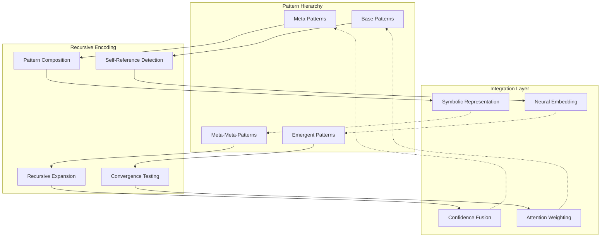
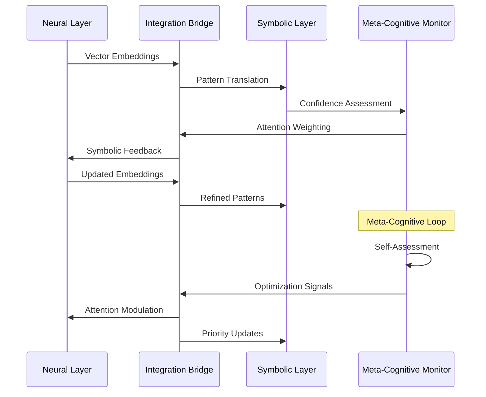
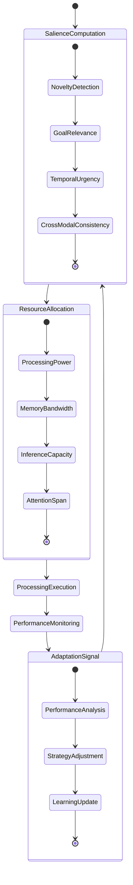
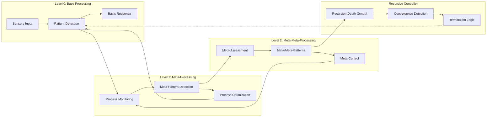
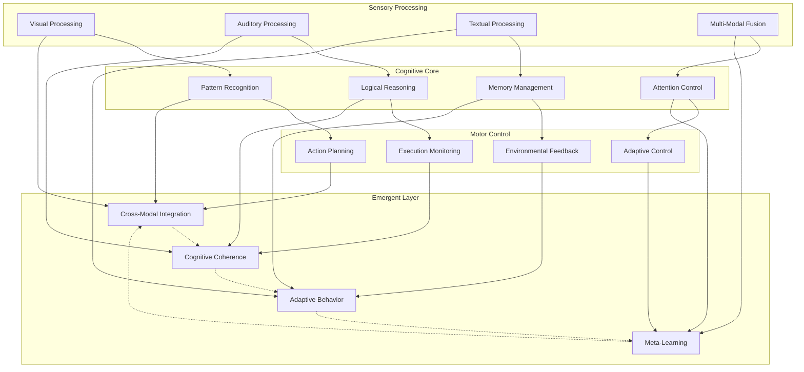
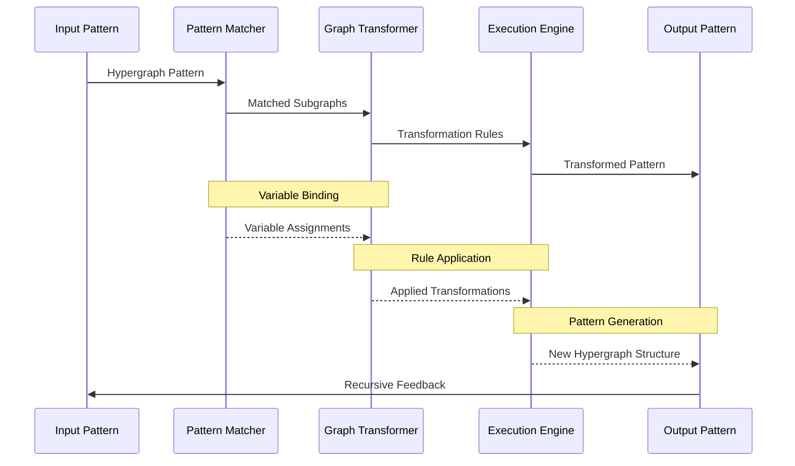
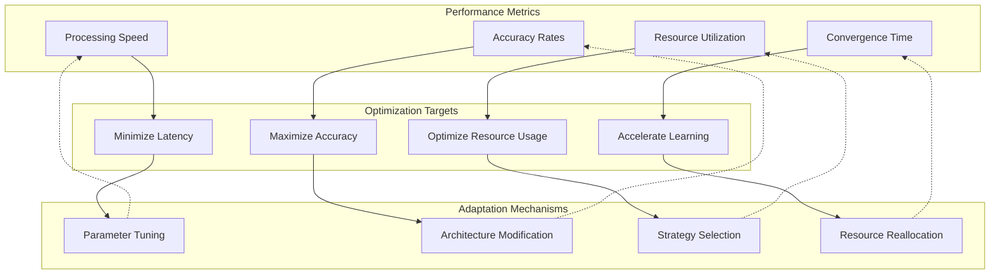

# Cognitive Patterns and Recursive Implementation Pathways

This document provides detailed analysis of the emergent cognitive patterns and recursive implementation pathways that characterize the OpenCog Central MORK (Meta-Organizational Recursive Kernel) system.

## Overview

The MORK system implements sophisticated cognitive patterns through recursive hypergraph transformations and emergent neural-symbolic integration. These patterns enable adaptive attention allocation, self-modifying code structures, and meta-cognitive monitoring capabilities.

## Emergent Cognitive Patterns

### 1. Hypergraph Pattern Encoding

The core cognitive patterns are encoded as hypergraph structures within the AtomSpace, enabling complex relationship representation and recursive pattern matching.



**Pattern Encoding Mechanisms:**
- **Connector Graphs**: Link Grammar-style connector patterns for relationship encoding
- **Truth Value Propagation**: Probabilistic confidence through pattern hierarchies
- **Recursive Binding**: Variable unification across pattern levels
- **Emergent Detection**: Recognition of higher-order patterns from composition

### 2. Neural-Symbolic Integration Patterns

The integration between neural processing and symbolic reasoning follows specific patterns that enable cognitive synergy.



**Integration Mechanisms:**
- **Bi-directional Translation**: Neural vectors ↔ Symbolic patterns
- **Confidence Fusion**: Weighted combination of neural and symbolic confidence
- **Attention Synchronization**: Coordinated focus allocation across modalities
- **Meta-Cognitive Monitoring**: Self-assessment of integration quality

### 3. Adaptive Attention Allocation Patterns

The attention system implements dynamic resource allocation based on salience computation and goal-directed processing.



**Attention Mechanisms:**
- **Information-Theoretic Surprise**: Novelty detection through entropy analysis
- **Utility Function Optimization**: Goal relevance scoring
- **Deadline-Driven Priorities**: Temporal urgency computation
- **Coherence Rewards**: Cross-modal consistency bonuses

## Recursive Implementation Pathways

### 1. Self-Referential Pattern Analysis

The system implements sophisticated self-referential processing through recursive pattern analysis.



**Recursive Mechanisms:**
- **Depth Control**: Automatic recursion depth management
- **Convergence Detection**: Pattern stability monitoring
- **Self-Modification**: Code-data equivalence enabling self-editing
- **Meta-Cognitive Loops**: Higher-order reasoning about reasoning

### 2. Emergent Cognitive Synergy

The system exhibits emergent cognitive properties through the interaction of multiple specialized subsystems.



**Synergy Mechanisms:**
- **Cross-Modal Integration**: Information fusion across sensory modalities
- **Cognitive Coherence**: Consistency maintenance across reasoning chains
- **Adaptive Behavior**: Dynamic strategy adjustment based on performance
- **Meta-Learning**: Learning about learning processes themselves

### 3. Hypergraph Transformation Patterns

The AtomSpace implements sophisticated hypergraph transformations that enable complex cognitive operations.



**Transformation Types:**
- **Pattern Matching**: Variable unification and subgraph identification
- **Graph Rewriting**: Rule-based structural transformations
- **Execution**: Program execution within the hypergraph structure
- **Composition**: Pattern combination and hierarchical construction

## Cognitive Synergy Optimization

### 1. Performance Metrics

The system continuously monitors cognitive performance through multiple metrics:



### 2. Synergy Detection Algorithms

The system implements sophisticated algorithms for detecting and enhancing cognitive synergies:

**Cross-Modal Synergy Detection:**
- Information-theoretic measures of multi-modal coherence
- Temporal correlation analysis across processing streams
- Causal relationship inference between cognitive modules

**Emergent Pattern Recognition:**
- Higher-order pattern detection through recursive analysis
- Novelty assessment for emergent cognitive structures
- Adaptive threshold adjustment for pattern significance

**Optimization Strategies:**
- Genetic algorithm-based architecture evolution
- Reinforcement learning for strategy selection
- Meta-learning for optimization parameter adaptation

## Implementation Guidelines

### 1. Recursive Processing Implementation

```atomese
; Example recursive pattern for self-referential processing
(DefineLink
    (DefinedSchemaNode "RecursiveProcessor")
    (LambdaLink
        (VariableList
            (VariableNode "$pattern")
            (VariableNode "$depth"))
        (CondLink
            (GreaterThanLink
                (VariableNode "$depth")
                (NumberNode 0))
            (ExecutionOutputLink
                (DefinedSchemaNode "RecursiveProcessor")
                (ListLink
                    (ProcessPatternLink (VariableNode "$pattern"))
                    (MinusLink
                        (VariableNode "$depth")
                        (NumberNode 1))))
            (VariableNode "$pattern"))))
```

### 2. Attention Allocation Implementation

```atomese
; Salience computation with multi-modal integration
(DefineLink
    (DefinedSchemaNode "ComputeSalience")
    (LambdaLink
        (VariableNode "$atom")
        (PlusLink
            (TimesLink
                (NoveltyScoreLink (VariableNode "$atom"))
                (NumberNode 0.4))
            (TimesLink
                (GoalRelevanceLink (VariableNode "$atom"))
                (NumberNode 0.3))
            (TimesLink
                (TemporalUrgencyLink (VariableNode "$atom"))
                (NumberNode 0.2))
            (TimesLink
                (CoherenceScoreLink (VariableNode "$atom"))
                (NumberNode 0.1)))))
```

### 3. Neural-Symbolic Integration Implementation

```atomese
; Confidence fusion mechanism
(DefineLink
    (DefinedSchemaNode "FuseConfidence")
    (LambdaLink
        (VariableList
            (VariableNode "$neural_conf")
            (VariableNode "$symbolic_conf"))
        (DivideLink
            (PlusLink
                (TimesLink
                    (VariableNode "$neural_conf")
                    (AttentionWeightLink "neural"))
                (TimesLink
                    (VariableNode "$symbolic_conf")
                    (AttentionWeightLink "symbolic")))
            (PlusLink
                (AttentionWeightLink "neural")
                (AttentionWeightLink "symbolic")))))
```

## Future Directions

### Enhanced Cognitive Patterns
- **Quantum-Classical Integration**: Hybrid quantum-classical processing patterns
- **Distributed Cognition**: Multi-agent cognitive coordination patterns
- **Biological Modeling**: Brain-inspired processing patterns
- **Emergent Consciousness**: Patterns for conscious experience modeling

### Advanced Recursive Mechanisms
- **Infinite Recursion Handling**: Safe infinite recursion with resource bounds
- **Meta-Meta-Learning**: Learning about learning about learning
- **Self-Modifying Architecture**: Dynamic architectural reconfiguration
- **Consciousness Recursion**: Self-aware recursive processing

### Optimization Enhancements
- **Multi-Objective Optimization**: Pareto-optimal cognitive performance
- **Adaptive Architecture**: Dynamic system reconfiguration
- **Predictive Optimization**: Anticipatory performance optimization
- **Emergent Optimization**: Self-organizing optimization processes

---

*This document captures the current understanding of cognitive patterns and recursive implementation pathways in the OpenCog Central system. It serves as a guide for both understanding existing patterns and developing new cognitive capabilities.*